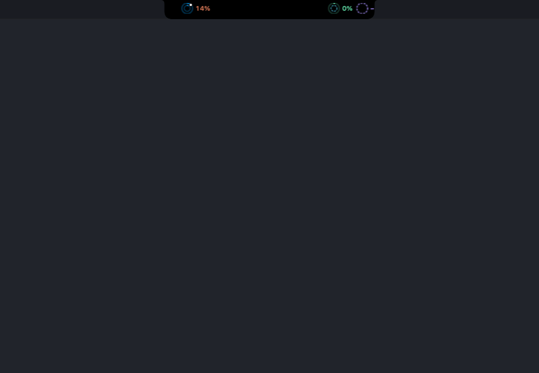
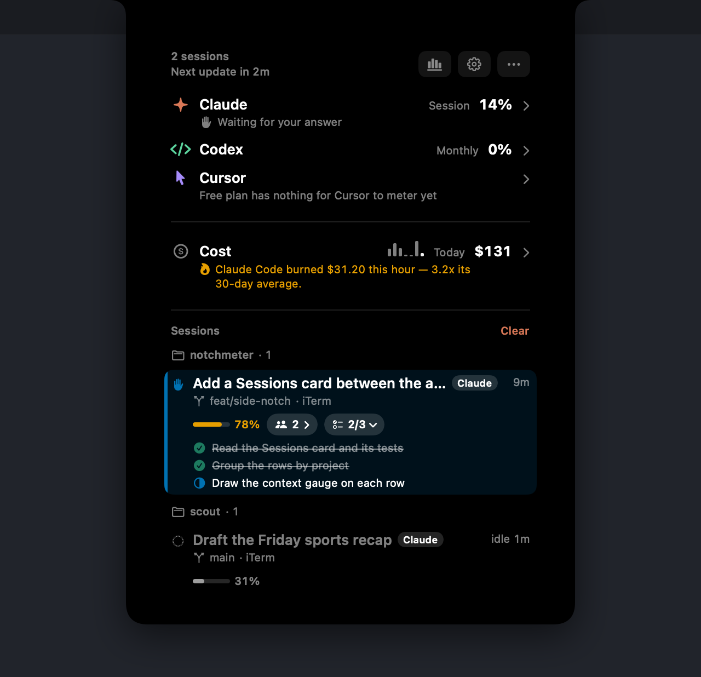
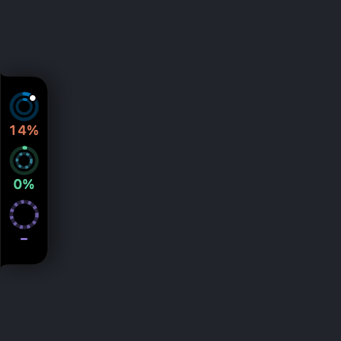
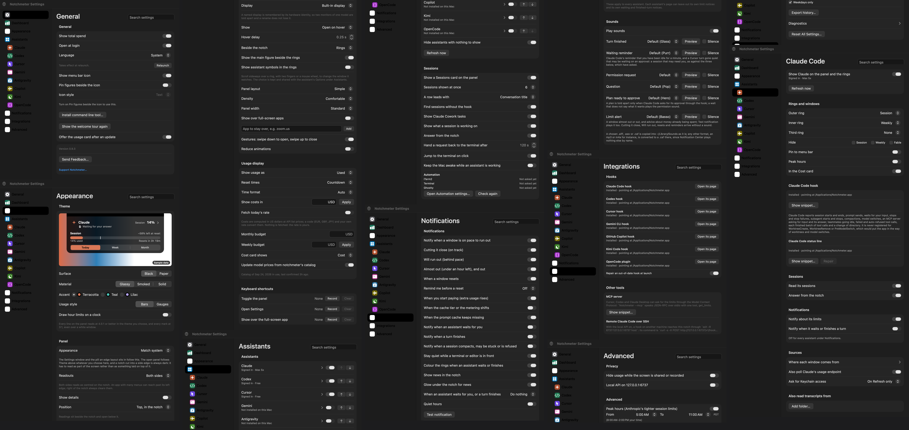

# Notchmeter



*Hover the rings beside the notch and the panel opens: cost, pace, projections and what to do next.*

**Your menu bar ran out of room three apps ago. This one doesn't take any.**

[](https://github.com/Amir-Hackett/notchmeter/actions/workflows/ci.yml)

Usage meters for AI coding tools, living in the MacBook notch — or on any screen edge you prefer. Small rings sit beside the notch all the time; hover and it opens into the full readout.

- **Claude Code** — the 5-hour session window, the weekly window, and the per-model weekly limits Anthropic publishes (Fable, Sonnet, Opus…), plus what your local Claude Code sessions would have cost at API list prices: today, yesterday, and the last 30 days, with a 30-day trend.
- **Codex** — the session, weekly or monthly rate-limit windows from the same backend Codex itself asks, with the snapshots Codex writes into session rollouts as a fallback when offline.
- **Cursor** — included plan usage and on-demand spend for the current billing cycle, read the way cursor.com's own dashboard reads it.
- **Antigravity / Gemini CLI** — the per-model quota Google meters for Gemini CLI and Antigravity (Gemini Pro, Gemini Flash, Gemini Flash Lite, and any Claude or GPT model the plan covers), from the same Code Assist endpoint Gemini CLI's `/stats` reads, with the Google login Gemini CLI keeps on this Mac.
- **GitHub Copilot** — the premium-request allowance for the month (and the chat and completion quotas when a plan meters them), from the endpoint Copilot's own editor plugin asks, with the token that plugin (or `gh`) keeps on this Mac.

Every meter shows a pace tick (where an even burn would be right now), a projection ("~67% left at reset" or "Runs out in 2h"), and the reset time as a countdown or an exact time.

The rings follow a calm rule ([`Presence.swift`](Sources/Notchmeter/Presence.swift)): small and dim while every window is under 40 % and on pace, full size once one passes 40 % or runs close to its pace (the ring's own tint turns orange from 80 %), and slowly pulsing once one is behind pace, has run out, or Claude Code is waiting for you. With the hook installed and no Claude Code session running, a window on pace stays quiet however full it is, and *Hide when idle* shrinks the rings to a dot after 30 quiet minutes. Status never rests on colour alone: pace notes carry a symbol and the rings a cap, the status colours are Wong's colour-blind-safe set, every meter has a VoiceOver label, Reduce Motion (or the app's own Reduce animations) is honoured, Increase Contrast brightens the tracks and Reduce Transparency swaps glass for black, and on macOS 26 both the edge pills and the panel below the notch are Liquid Glass.

Every other meter tells you how much. Notchmeter also tells you what to do about it: an **Advice** strip under the Cost card, and a notification when a window's pace crosses, both worded as an instruction rather than a percentage. See [Advice and notifications](#advice-and-notifications).

With the optional [Claude Code hook](docs/hooks.md), the notch refreshes the moment a turn ends, counts the sessions you have running ("2 sessions · working 2m 10s"), and shows a dot on the Claude ring (with a count past one) while Claude Code waits for your permission or your answer in some project. With the optional [status line](docs/hooks.md#the-status-line), a thin arc around the Claude ring shows how full the session's context window is, the card says "Context 62% · Opus · $1.23 this session", and the official session and weekly figures come from Claude Code itself, so the endpoint is not asked at all while a session is running.

Notchmeter never signs in anywhere and never stores a token. Each reading is borrowed from the tool that owns the account; switch accounts in that tool and the notch follows.

## Screenshots

| The open panel | Left edge | Settings |
|---|---|---|
|  |  |  |

The pictures are drawn by `Notchmeter --render-assets docs/media` from the real views over fixed readings (Claude on Max 5x a third of the way into a quiet session, Codex and Cursor on free plans), not from a live account, so they come out the same on every build and show nobody's usage.

## Install

> Until v0.1.0 is published these links are dead; the release is blocked on the Apple Developer Program enrolment described in [docs/release.md](docs/release.md). Build from source meanwhile (next section).

- **Download** [`Notchmeter.dmg`](https://github.com/Amir-Hackett/notchmeter/releases/latest/download/Notchmeter.dmg) from the latest release and drag it to Applications. The DMG is Developer ID signed and notarised, and the app updates itself through Sparkle.
- **Homebrew**, from the tap ([`packaging/homebrew/notchmeter.rb`](packaging/homebrew/notchmeter.rb)): `brew tap Amir-Hackett/tap && brew install --cask notchmeter`.

macOS 14 or later, Apple silicon or Intel.

### Testing a pre-release build

An unsigned or ad-hoc-signed build (the CI artifact, a `--dry-run` DMG, anything before the Developer ID exists) is refused by Gatekeeper on any Mac but the one that built it. On macOS 15 and later, right-click › Open no longer bypasses that. Two routes: open it once, let it be refused, then allow it under System Settings › Privacy & Security › *Open Anyway*; or remove the quarantine attribute before the first launch:

```bash
xattr -d com.apple.quarantine /Applications/Notchmeter.app
```

A quarantined copy launched from Downloads or straight from the DMG also runs App-Translocated, from a random read-only path where Open at login and updates cannot work; the app notices and offers to move itself to Applications.

## Build and install

Needs macOS 14+ and the Xcode Command Line Tools only (no Xcode). Everything is plain SwiftPM.

```bash
scripts/build.sh install
```

That builds `build/Notchmeter.app`, ad-hoc signs it, copies it to `/Applications` and launches it. Other forms:

```bash
scripts/build.sh          # just build the .app
scripts/build.sh run      # build and launch from build/
scripts/test.sh           # unit tests for the parsers, pace math and cost engine
swift run Notchmeter --probe            # print what each provider reads and the advice it adds up to, from the terminal
swift run Notchmeter --probe --no-prompt --json   # the same as one versioned JSON object (schema notchmeter.limits.v1) with an exit code, see docs/testing.md
build/Notchmeter.app/Contents/MacOS/Notchmeter --smoke               # on-screen self check (no Keychain prompt)
build/Notchmeter.app/Contents/MacOS/Notchmeter --smoke --edge left   # same, trying another layout
build/Notchmeter.app/Contents/MacOS/Notchmeter --smoke --hover-sim   # scripted hover: one open, no flicker, one close
build/Notchmeter.app/Contents/MacOS/Notchmeter --smoke --lang zh-Hans   # same, with the copy pinned to Simplified Chinese
build/Notchmeter.app/Contents/MacOS/Notchmeter --hook                # Claude Code hook command, see docs/hooks.md
build/Notchmeter.app/Contents/MacOS/Notchmeter --statusline          # Claude Code status-line command, see docs/hooks.md
build/Notchmeter.app/Contents/MacOS/Notchmeter --render-assets docs/media   # the README's pictures, from fixed readings (no Keychain, no network)
build/Notchmeter.app/Contents/MacOS/Notchmeter --render-gallery docs/launch/gallery   # the Product Hunt composites and thumbnail
```

A local build is ad-hoc signed and never checks for updates. Shipped builds are signed with Developer ID, notarised and updated through Sparkle by `scripts/release.sh`; [docs/release.md](docs/release.md) has the one-time setup and the per-release command.

## First launch

Notchmeter reads Claude Code's saved login without a Keychain dialog: it asks the Keychain with prompts disabled, then reads the item the way `/usr/bin/security find-generic-password -w` does (macOS lets that tool read what the same user's Claude Code wrote), then `$CLAUDE_CONFIG_DIR/.credentials.json` and `~/.claude/.credentials.json`, then `CLAUDE_CODE_OAUTH_TOKEN` (from the environment, or from `launchctl getenv` when the app was not started from a shell). The Keychain dialog appears only when every silent route fails and you ask for it: *Ask for Keychain access* in Settings, the Claude card's refresh or ⌘R may prompt while *Keychain prompts* (Settings › Advanced) is *Only on refresh*, and never with it set to *Never*, so a rebuild, which changes the ad-hoc signature, cannot bring back a loop of dialogs. When it does ask, choose **Always Allow**. Codex, Cursor, Antigravity and Copilot need no permission. On the first launch Settings opens once with an offer to add the [Claude Code hook](docs/hooks.md); it is a button, never automatic. Notification permission is not asked at launch: the first alert asks provisionally (it lands quietly in Notification Center) and the Notifications toggle or Test button asks properly.

## Layout and settings

Right-click (or Control-click) the rings, or use the **Options** button in the panel's footer, for the menu; **Settings…** opens the full window. Settings is a floating window that never takes focus away from the app you are working in, and the panel stays closed while it is open, so the two never overlap. The app has a real main menu even though it shows no menu bar entry of its own, so ⌘, opens Settings, ⌘Q quits, ⌘W closes Settings, Escape closes Settings or the open panel, ⌘R refreshes, and Cut, Copy, Paste and Select All work in every text field.

| Setting | Choices |
|---|---|
| Position | Top, in the notch · Left edge · Right edge · Bottom, above the Dock. On a Mac without a notch the top layout is a pill under the menu bar |
| Display | Built-in display · Main display · Display with the pointer · All displays · any display by name, with a fallback when it is unplugged |
| Show | Open on hover · Open on click · Always open · Hide when idle, plus a Hover delay of 0.1–1 s |
| Beside the notch (In the pill, on an edge) | Rings · Rings + numbers · Numbers, the percentages of each tool's two chosen windows ("14% · 4%"), optionally with the main window's reset countdown ("90% 32m · 4%") |
| Density, Panel width | Comfortable · Compact; Standard (380 pt) · Wide (460 pt) |
| Show over full-screen apps | on / off, applied to the notch window and the edge pills alike |
| Gestures | swipe down over the rings opens, swipe up over the panel closes, with a haptic tick; off under Reduce Motion |
| Keyboard shortcuts | a global shortcut to toggle the panel and one to open Settings, recorded in Settings |
| Show menu bar icon | off by default on a notched Mac, so the menu bar keeps its room; on by default when the panel cannot sit beside a notch. Carries the Options menu (Quit and Settings one click away, reachable with VoiceOver's VO-M-M) and an optional pin of the pinned assistants' figures, as text or as mini bars tinted by pace |
| Show total spend | on / off (the Cost card and the trend) |
| Show usage as, Reset times | Used · Left; Countdown ("Resets in 3h 40m") · Exact time ("Resets today at 10:50 PM"). Clicking the figure or the reset line in the panel flips the setting too |
| Time format | Auto · 12-hour · 24-hour |
| Show costs in | USD, or a currency code with a rate you type; nothing is fetched |
| Monthly budget, Weekly budget | in that currency; the Cost card's ring fills against the month with the meters' pace tick, the Advice strip projects the month against it ("At this rate the month costs $310 against a $200 budget"), and the on-track, behind and run-out notifications treat it as a window whose period is the month or the week |
| Cost card | Cost · Tokens · $/MTok as the figure each range leads with; a Cursor mode once its usage events are read; *Export history…* writes the daily-totals file as CSV or JSON |
| Peak hours | Anthropic's weekday 05:00–11:00 Pacific window (editable), applied per assistant: inside it the session projection assumes the peak rate, the advice names the next off-peak start for a long job, and the run-out interval keeps peak and off-peak rates apart |
| Hide usage while the screen is shared or recorded | the rings keep their shape but lose their digits and the panel hides the Cost card while Zoom, Meet, QuickTime or Screen Sharing capture the screen |
| Local API | `GET http://127.0.0.1:6737/v1/limits`, the same JSON as `--probe --json`, and `POST /v1/hook` for another machine's Claude Code hook events over an SSH tunnel; loopback only, the Host header must be the loopback address, and a request carrying an Origin header is refused unless the origin is allow-listed here; off by default |
| Open at login | on / off, with an *Approve in System Settings* button when macOS holds the item for approval and a hint when the app moved |
| Notifications | the master switch, one toggle each for *Cutting it close*, *Will run out*, *Almost out* and *Limit hit* (time-sensitive), *When a window resets*, a reminder 10 min or 1 h before a reset, *Notify when Claude Code waits for you* (time-sensitive) and *when a turn finishes* (longer than N minutes), *When you start paying (extra usage rises)*, *When the cache tier or the metering shifts* (once a day), a sound per kind of event (pace, waiting, finished; a file of yours is copied into `~/Library/Sounds`), quiet hours, and a **Test notification** button. A notification is withdrawn from Notification Center when its reason passes (the window reset, the session stopped waiting) |
| Assistants | switch each tool on or off; the arrows set their order, which the panel's cards, the rings beside the notch (the first tool on its left, the rest on its right) and the edge pills all follow; per tool, which two windows the rings show, which windows the card hides and whether it is pinned to the menu bar; Codex reset credits, Cursor usage events and Copilot organisation billing (each opt-in); *Ask for Keychain access* for Claude |
| Claude Code hook | status ("Installed · pointing at /Applications/Notchmeter.app", "Installed but points at an old path", "Not installed"), the `settings.json` snippet with a Copy button, Add or Repair after a backup, and the status line beside it ([docs/hooks.md](docs/hooks.md)) |
| Also read transcripts from | extra folders of Claude Code transcripts (synced from another Mac; a `projects` folder or a flat folder of session folders); Claude Desktop's Cowork sessions are read automatically |
| Advanced | Keychain prompts (Only on refresh · Never); Keep the Mac awake while Claude Code is working, and whether on battery; Repair a hook that points at an old copy at launch; Proxy (empty follows Network settings; `http://` or `socks5://host:port` routes this app's vendor requests); Debug logging (each vendor request's status and size in the unified log, never a token); Copy diagnostics (the last 10 minutes of the app's log, each assistant's state, the layout and the macOS version, home folder scrubbed); Beta updates; Language; Install command line tool…; the MCP server snippet; Reset All Settings…, Reduce animations |

The top layout merges with the physical notch (compact readouts beside it, the panel below). The edge layouts are Codenotch-style pills that open into the same panel; they keep clear of the Dock, and a bottom bar sits above the strip that reveals a hidden Dock. Every window's collection behaviour follows the full-screen setting, and both layouts re-derive their screen when a display is plugged in, the lid opens or closes, or mirroring changes. The panel is never taller than the screen's usable height: past that (five tools, the cost card and advice on a small display) it scrolls, and it shows no scroller while it fits.

**Hover.** The panel opens once the pointer has rested on the rings for the hover delay (250 ms by default), so passing the top of the screen does nothing, and closes 400 ms after the pointer has left the panel (with 8 pt of grace), at once on a click outside it, Escape, a Spaces switch, display sleep or the screen lock, and never while set to Always open. In *Open on click* the pointer does nothing and a click on the rings toggles. The decision is a pure state machine ([`HoverIntent.swift`](Sources/Notchmeter/HoverIntent.swift)) fed with the pointer's position against the two visible shapes, measured from the notch and the content rather than from the window, and it ignores the pointer for up to 350 ms after each transition, so the panel's own open and close animation can never re-trigger it. A Control-click is a secondary click and never counts as a click. `--smoke --hover-sim` drives that path with a scripted pointer and prints every decision.

## From the terminal and from agents

`notchmeter` (Settings › Advanced › *Install command line tool…* links it into `~/.local/bin`, or `/usr/local/bin`) prints every window with its pace and source and the advice; `notchmeter claude --json` narrows to one tool as the `--probe --json` document; the exit code is the report's (`0` fine, `10` near a limit, `11` a limit hit, `20` no session, `30` no data). It reads the running app's report file, or its local API, instead of asking every vendor again, and probes only when the app is not running; `--force` reads afresh. `Notchmeter --mcp` is an MCP server over stdio with one tool, `get_limits`, for Cursor, Codex and Claude Desktop; Settings › Advanced shows the configuration snippet. `--probe --no-prompt --json --history` adds the daily history. The Claude Code skill in [`skills/notchmeter/SKILL.md`](skills/notchmeter/SKILL.md) uses the same commands.

## Languages

Notchmeter runs in English, Simplified Chinese (简体中文), Traditional Chinese (繁體中文), Japanese (日本語), Korean (한국어) and Vietnamese (Tiếng Việt), in whichever of them macOS picks for it from System Settings › General › Language & Region (system-wide, or just for Notchmeter under Applications). Product and tool names stay as they are; everything else, the panel, Settings, the Options menu, notifications and every provider message, comes from [`Sources/Notchmeter/Resources/<language>.lproj/Localizable.strings`](Sources/Notchmeter/Resources), a classic `.strings` table keyed by the English copy and read through `L("…")` ([`Localization.swift`](Sources/Notchmeter/Localization.swift)). `--lang zh-Hans` pins the copy for one run whatever the system language; `--smoke --lang ja` prints a line of it. The four languages added in September 2026 were drafted here and need a native review before a release; corrections are one-line pull requests. To add a language, add its `.lproj` with the same keys, list it in `Localization.languages` and in `CFBundleLocalizations` in `scripts/Info.plist`; `scripts/test.sh` checks that every table carries every key the code uses, with the same format arguments, and nothing else. Settings › Advanced › Language switches the app's language without a trip to System Settings (it writes `AppleLanguages` into Notchmeter's own preference domain and relaunches). The compact strip beside the notch, the meters and the sparklines are pinned left-to-right in every language, because they refer to the physical notch and to time running forward; the rest of the panel would mirror for a right-to-left language, of which none is shipped.

## Advice and notifications

The rules are pure functions in [`Advisor.swift`](Sources/Notchmeter/Advisor.swift), run over every visible tool's live reading and the cost summary, and pinned by unit tests. The strip shows at most three lines, highest priority first, and is not there at all when there is nothing to say.

| Priority | When | Reads |
|---|---|---|
| Needs you | Claude Code's [hook](docs/hooks.md) reports a permission prompt or a question; with session ids the line names the project | *Claude Code is waiting in notchmeter (and 1 more).* |
| Run-out | any window is behind pace and has a run-out time (from the measured drain of the last hour when the [drain log](#the-drain-log) has one, else the even-burn projection); if another tool still has half of its main window, it is named | *At this rate you hit the Claude weekly cap Thursday at 2:00 PM, 3d 4h before reset. Codex weekly is at 22%.* |
| Switch models | a per-model window (Fable, Sonnet, Opus…; Gemini Pro, Gemini Flash…; GPT-5.3-Codex-Spark) is 85 % used and another model, or the overall window, has 40 % left | *Opus weekly is 91%. Sonnet is 34%. Switch models, not tools.* |
| Wait | a window is out or behind pace, resets within the hour, and no other tool has room | *Claude session resets in 40m; wait rather than switch.* |
| Reset credit | a Codex reset credit expires within a day while a Codex window is behind pace (opt-in read) | *A Codex reset credit expires in 5h. Claim it in Codex.* |
| Burn | the last hour cost at least three times your 30-day average active hour (see the Cost card) | *This hour burned $8.40 — 6x your 30-day average.* |
| Room elsewhere | a tool's main window is on track or behind and another tool has half of its own left | *Codex has 78% of its weekly left.* |

A tool's *main window* is its longest tool-wide one: the weekly for Claude and Codex, the billing cycle for Cursor, the month for Copilot; Antigravity publishes only per-model windows, so it has none. A per-model window is named by its cadence ("Fable weekly", "Gemini Pro daily", or "Gemini Pro quota" while the vendor declares no window length). Times follow the Reset times and Time format settings.

**Notifications** fire at pace crossings, not percentage crossings, because a percentage alert arrives when it is too late to change anything. Per window and reset period, [`NotificationScheduler.swift`](Sources/Notchmeter/NotificationScheduler.swift) sends one notification when the pace first reaches *on track* (passive: no sound, no banner over a full-screen app), one when it first reaches *behind* (active), and one when the run-out time first comes within an hour (time-sensitive, with sound if allowed); a state never repeats within a period, a calmer state is never announced, and nothing is sent during the first tenth of a window, when the projection is noise. Each of the three has its own toggle. A fourth, *When a window resets*, fires once when a window that was at least 80 % used or behind pace passes its reset ("Claude session reset — 100% until it resets today at 3:40 PM"), and an optional reminder fires 10 minutes or an hour before such a reset; both run on a timer, not on a reading. With the hook, two more: *Notify when Claude Code waits for you* and *Notify when a turn finishes* (longer than N minutes), both quiet while a terminal or editor is frontmost and inside the quiet hours. Clicking any banner opens the panel on the tool's card (Settings, for the test alert). The body is the same line the strip would show. What was sent is remembered across relaunches. The setting is on by default; permission is asked provisionally at the first alert and properly when the toggle is turned on, never at launch; `--smoke` and `--probe` never send anything.

## How it reads each tool

| Tool | Where the login comes from | Where the numbers come from |
|---|---|---|
| Claude Code | Keychain item `Claude Code-credentials` (read with prompts off, then through `/usr/bin/security`), else `$CLAUDE_CONFIG_DIR/.credentials.json` or `~/.claude/.credentials.json`, else `CLAUDE_CODE_OAUTH_TOKEN`; a setup on `ANTHROPIC_API_KEY`, Bedrock or Vertex has no plan window and the card says so | `GET https://api.anthropic.com/api/oauth/usage` |
| Claude Code cost | — | `~/.claude/projects/**/*.jsonl`, priced per model with the five token buckets (input, output, 5-minute and 1-hour cache writes, cache reads), times 1.1 when the response reports `inference_geo: "us"`; a line's own `costUSD` wins when present; a streamed message's repeated lines collapse by message id + request id to the one carrying the real output count |
| Codex | `auth.json` in `$CODEX_HOME`, else `~/.config/codex`, else `~/.codex` (token read, never refreshed or written); the plan name from Codex's own slug table | `GET https://chatgpt.com/backend-api/wham/usage`, falling back to the newest `rate_limits` line in `~/.codex/sessions/**/*.jsonl` |
| Cursor | `cursorAuth/accessToken` in `~/Library/Application Support/Cursor/User/globalStorage/state.vscdb` | `GET https://cursor.com/api/usage-summary` (falls back to `/api/usage` on request-metered plans), split into the plan's Cursor-model and other-model shares and the team pool when the plan has one; opt-in, `POST https://cursor.com/api/dashboard/get-filtered-usage-events` for the last 30 days of usage events with Cursor's own cost per event |
| Antigravity | `~/.gemini/oauth_creds.json`, the Google login Gemini CLI caches (token read, never refreshed or written) | `POST https://cloudcode-pa.googleapis.com/v1internal:loadCodeAssist` for the project and tier, then `POST https://cloudcode-pa.googleapis.com/v1internal:retrieveUserQuota` for the per-model buckets: the two reads Gemini CLI itself makes at every start |
| GitHub Copilot | `oauth_token` in `~/.config/github-copilot/apps.json` (every `github.com` entry tried in turn), then `hosts.json`, then `github.com: oauth_token` in `~/.config/gh/hosts.yml`, the tokens Copilot's editor plugin or `gh` keep (read, never refreshed or written); a token that does not answer falls through to the next | `GET https://api.github.com/copilot_internal/user` with the Copilot client headers (`Editor-Version`, `Editor-Plugin-Version`): the read the plugin makes to show its own quota; opt-in, `GET /user/orgs` then `/orgs/<org>/settings/billing/usage/summary` for the month's organisation credits and spend, hidden-by-default windows |
| Claude Code status line | — | Claude Code hands `Notchmeter --statusline` a JSON payload after every turn; the command forwards the context fill, `rate_limits.five_hour`/`seven_day`/`spend_limit`, the session cost, the model and effort, the session id and the folder name over the local notification path; while a report is under five minutes old the Claude endpoint is not read ([docs/hooks.md](docs/hooks.md)) |
| Codex reset credits (opt-in) | the same `auth.json` token | `GET https://chatgpt.com/backend-api/wham/rate-limit-reset-credits`, shown and never claimed |

Every window carries its source, and a card tags anything that is not the vendor's own figure: *From Claude Code's status line*, *From rate-limit headers*, *From Codex's last session file* (the newest figure a tool wrote to disk, which may be stale) or *Estimate* (the budget); `--probe --json` carries the same as `source`. Cost is an estimate at Anthropic's published API rates for the models in your transcripts (`Sources/Notchmeter/ModelPricing.swift`, or Claude Code's own `modelPricing` table and Notchmeter's `pricing-overrides.json` when present); a subscription does not bill this way, it is the API-equivalent value of the work. The card's ranges are Today, Yesterday, Week (since the live Claude weekly window started, with "$1.58 per 1% of weekly"), Month (calendar month to date), 30 days and 90 days; under each, the models ranked by cost with their share, the token count and cache-read share ("4.2M tokens · 71% cache reads"), the top projects by the transcript's working directory ("Top: notchmeter $12 · scout $4"), the current 5-hour block aligned to the Session meter with its tokens per minute, and for 90 days the total since first use. Hovering a bar of the 30-day trend names the day, its cost and its top model. Once there are five active hours to compare against, the card also shows the last hour against your average active hour over the last 30 days ("Last hour $8.40 · 6x your 30-day average"). Only transcripts touched in the last 30 days are read; per-file results and quarter-hour totals are cached in `~/Library/Caches/Notchmeter/` so relaunches are instant and an unchanged file is folded from its totals rather than re-priced (only the current block's transcripts keep their entries, which is all the last-hour and block figures ever ask for), and an append-only daily-totals file there outlives Claude Code's transcript cleanup, so a day whose transcript is gone keeps the larger figure it was seen with. How the estimate is built, every multiplier it applies, and where it is known to diverge from a bill, is written down in [docs/accuracy.md](docs/accuracy.md), and a golden-transcript test suite pins the numbers. The rate-limit meters, by contrast, are account-wide already: they come from the vendor, not from this Mac's files.

### The drain log

The most common complaint about every meter in this space is "my limit drained abnormally fast and I cannot see why". Notchmeter keeps an append-only log of every successful read per window (`~/Library/Application Support/Notchmeter/drain-log-v1.jsonl`: time, tool, window id, used fraction, reset; never a token; seven days, a few KB a day) and shows "12% → 61% in the last hour" under a meter that moved, a 24-hour sparkline of the main window in each card, and the measured rate feeds the run-out projection and the notifications in place of the even-burn assumption. `--probe` prints the same drain lines.

Antigravity and Gemini CLI meter against the same Google backend, and the login Gemini CLI caches is the only one on disk: the Antigravity app and its `agy` CLI keep theirs in the Keychain and publish quota only through a local server inside the running app, which Notchmeter does not attach to. So the Antigravity meter needs one Google sign-in through Gemini CLI (`gemini`, then *Login with Google*); an API-key or Vertex AI setup has no quota to read. The buckets are grouped the way Gemini CLI's own `/stats` groups them, every Gemini model of a tier sharing one pool, and Google declares no window length for them (its docs call them per-day request limits), so these meters carry no pace tick or projection until it does. Since June 2026 Google serves this endpoint only to Code Assist Standard and Enterprise accounts; a personal account gets a sentence saying so, not an HTTP code. Adding a tool means one `UsageProvider` actor in `Sources/Notchmeter` and one line in `ProviderRegistry`.

## Privacy and terms

Notchmeter is a read-only instrument. In plain terms:

**What it reads.**

- Claude Code's saved login: the Keychain item `Claude Code-credentials` (asked with prompts off, then through `/usr/bin/security find-generic-password`), or `$CLAUDE_CONFIG_DIR/.credentials.json` / `~/.claude/.credentials.json` when the Keychain has no such item, or `CLAUDE_CODE_OAUTH_TOKEN`. The access token, its expiry and the plan name are taken from it. Whether `ANTHROPIC_API_KEY`, `CLAUDE_CODE_USE_BEDROOK`-style variables or an `apiKeyHelper` are set is read as a yes/no, to say that an API-key setup has no plan window.
- Codex's saved login: the access token, account id and expiry in `auth.json` under `$CODEX_HOME`, `~/.config/codex` or `~/.codex`.
- Cursor's saved login: the `cursorAuth/accessToken` row of `~/Library/Application Support/Cursor/User/globalStorage/state.vscdb`. The database is copied to a private temporary file for the read and deleted straight after, so the editor's live database is never opened.
- Gemini CLI's saved Google login: the access token and its expiry in `~/.gemini/oauth_creds.json`.
- GitHub Copilot's saved token: `oauth_token` in `~/.config/github-copilot/apps.json` or `hosts.json`, or `gh`'s `~/.config/gh/hosts.yml`.
- Local transcripts, for the cost card and the offline fallback: the `usage` lines of `~/.claude/projects/**/*.jsonl` (also `$CLAUDE_CONFIG_DIR`, `~/.config/claude`, Claude Desktop's `~/Library/Application Support/Claude/local-agent-mode-sessions` when present, and any folder you add under *Also read transcripts from*; only files touched in the last 30 days), the line's `cwd` reduced to its last path component for the per-project split, and the newest `rate_limits` lines in `~/.codex/sessions/**/*.jsonl`.
- Claude Code's `modelPricing` table in `~/.claude/settings.json`, when one is set, so the estimate matches Claude Code's own figure.
- Modification times only, for the polling schedule: of files under the most recently changed `projects` folders of each transcript root, of `~/.codex/sessions/<today>` and `<yesterday>`, of Cursor's `state.vscdb`, of `~/.gemini/oauth_creds.json` and the entries of `~/.gemini/tmp`, `~/.gemini/antigravity` and `~/.gemini/antigravity-cli/conversations`, and of `~/.config/github-copilot`. Contents are not read for this.
- If you install the [Claude Code hook](docs/hooks.md), Claude Code hands `Notchmeter --hook` each event's JSON; the command keeps only the event name, whether Claude is waiting for you, the session id, the last path component of the working directory, the branch named by its `.git/HEAD`, the permission mode, a subagent's id and a stop failure's kind, and passes those to the running app. The status line command keeps the context window's fill, the two rate-limit windows, the session cost, the model name, the session id and the folder name, and nothing else of the payload.
- Whether the screen is being captured (a yes/no from the window server), only while *Hide usage while the screen is shared* is on.

**Where it sends things.** Each token goes to exactly one place: the usage endpoint of the vendor that issued it, over HTTPS, in the same read-only status request the vendor's own app or dashboard makes: `api.anthropic.com/api/oauth/usage`, `chatgpt.com/backend-api/wham/usage` (and, only if you opt in, `/wham/rate-limit-reset-credits`), `cursor.com/api/usage-summary` (and, only if you opt in, `/api/dashboard/get-filtered-usage-events`), `api.github.com/copilot_internal/user` (and, only if you opt in, `/user/orgs` and `/orgs/<org>/settings/billing/usage/summary`), and for Google the two calls Gemini CLI makes at every start, `cloudcode-pa.googleapis.com/v1internal:loadCodeAssist` and `:retrieveUserQuota`. Every request identifies itself with a `User-Agent: Notchmeter/<version>` header; nothing is disguised. Requests follow the proxy in Network settings, or the one you set in Settings › Advanced. Nothing is sent anywhere else. There is no telemetry, no analytics, no crash reporting and no server of ours. The optional local API answers on 127.0.0.1 only, to processes on this Mac, and is off by default; a vendor's Usage or Status link in a card opens that vendor's page in your browser and nothing else.

**What it keeps.** No token is copied anywhere lasting, logged, or printed; `--probe` and the unified log show parsed numbers only. What is persisted: your settings, the last good reading per tool and which notifications have been sent in this app's own preferences; quarter-hour totals per transcript in `~/Library/Caches/Notchmeter/` so relaunches are instant, with the entry-level detail behind them kept only for the transcripts of the current 5-hour block, and a daily-totals file there (day, cost, token counts, per-model and per-project cost) that outlives transcript cleanup; the drain log `~/Library/Application Support/Notchmeter/drain-log-v1.jsonl` (time, tool, window, used fraction, reset, and each extra-usage rise with the plan windows at the time); and the report file `~/Library/Application Support/Notchmeter/report-v1.json` beside it, the `--probe --json` document with the app's pid, rewritten every 30 seconds while the app runs so the command-line tool and the status line can read it. With Debug logging on, each vendor request's status code and size go to the unified log. Those hold timestamps, model names, token counts, message ids, project folder names and the inference-geography flag, never prompt or response text and never a token. Reset All Settings clears the preferences and relaunches; the caches and the log stay. The Homebrew cask's `zap` names every one of these paths.

**What it never does.** It never signs in, never refreshes a token, never opens a login page, and never makes an inference request, so it consumes no model capacity and cannot change the usage it reports. Each reading is borrowed from a tool you are already signed in to; sign out of that tool and the reading goes with it.

**How often.** The base cadence is every 5 minutes for every tool (Claude, Codex, Cursor, Antigravity, Copilot), and the local cost scan every minute (it only re-reads files that changed). Claude and Codex were 3 and 2 minutes until September 2026; they were raised to 5 because a 2–3 minute poll against a first-party endpoint from an unofficial client is the behaviour that gets noticed, and the hook, the status line and the hover refresh give freshness where it matters (a turn ending refreshes at once; while the status line reports, the Claude endpoint is not polled at all). The schedule adapts, by the rules in [`PollingPolicy.swift`](Sources/Notchmeter/PollingPolicy.swift): nothing at all while the screen is locked, the displays are asleep or the Mac is asleep; half as often on battery or in Low Power Mode; a quarter as often once a tool's files on disk have not changed for 30 minutes, which is checked once a minute with a few directory listings (Claude Code's three most recently changed project folders in each transcript root, Codex's rollouts for today and yesterday, the modification time of Cursor's state database, Gemini CLI's login file and its per-project and Antigravity folders, Copilot's config folder); never more than 15 minutes apart while awake, and never faster than the base cadence. Unlocking or waking reads everything at once (a few seconds after a wake, so the network is back first), a Claude Code hook event refreshes Claude at most once every 30 seconds, hovering the panel refreshes a tool at most once a minute, the footer's "Next update in…" line and ⌘R refresh everything now and a card's context menu refreshes one tool, a rate-limit answer backs off for at least a minute, and other failures back off from 30 seconds up to 10 minutes. A transport failure (no network, DNS down, a timeout) is not an error: the cached reading stays without a problem mark and the footer says "Offline, retrying". The panel footer always shows the real next read and why it is later than usual ("no agent activity", "on battery", "low power mode").

**Terms.** Each vendor's terms are written for its own apps and restrict automated access to its services in broad language, and reading an app's saved login from outside that app is a grey area under each of them. Notchmeter stays on the narrowest path there is: a login the vendor's own tool put on this Mac, used for one status read that tool itself makes, never stored, never passed on, never used for inference. Whether to run it under your account is your decision. If a vendor withdraws its usage endpoint, the meter reports the error and waits; it does not look for another way in. In particular it never probes Anthropic's inference endpoint for the rate-limit headers other meters read, because that is an inference call; the reasoning is in [docs/accuracy.md](docs/accuracy.md#why-there-is-no-header-fallback). For Claude there is now a sanctioned, zero-network source as well: the status line Claude Code itself hands its script, which carries the same session and weekly figures; with it installed the endpoint is not read while a session runs, and it is the fallback should Anthropic answer the [inquiry](docs/anthropic-inquiry.md) with a no.

## Energy

Measured on 2026-09-02 on an Apple M5 Pro running macOS 26.6.2 on battery power: `build/Notchmeter.app` launched as `Notchmeter --no-prompt`, the panel compact and untouched, the Claude session ring urgent (85 % and behind pace), and a heavy Claude Code job in the background: an orchestrator and three subagents appending to transcripts of 10 MB and more inside the current 5-hour block (3,811 transcripts under `~/.claude/projects`), the Claude endpoint read on the saved login, Codex on a free plan, Cursor on a free plan, Copilot not signed in. The first 45 seconds after launch (the initial reads and the first cost scan) were left out.

| Window | Method | Result |
|---|---|---|
| 60 s | `ps -o cputime=` before and after, divided by wall time | 0.84 CPU-seconds / 61 s = **1.4 %** of one core |
| 180 s including at least one cost scan | same | 2.99 CPU-seconds / 182 s = **1.6 %** of one core |
| the same 180 s in 30 s samples | `top -l 7 -s 30 -stats pid,cpu,mem -pid <pid>` | 0.0, 1.5, 6.5, 0.0, 0.8, 0.0, 0.8 % of one core |

The samples at 0.0 are the app between scans: the minute tick (power source and a few directory listings), the 30-second report file and the pill's drawing do not register. The 6.5 % sample is a cost scan, and the scan is the whole figure: an unchanged file is folded from its cached quarter-hour totals, but a file that changed inside the current 5-hour block is re-read at entry level for the last-hour and block figures, so the cost of a scan is the size of the transcripts being written right now, which in this measurement was several files of 10 MB and more. On a quiet day (one session writing a few hundred kilobytes) the same procedure in September 2026 read 0.02 % over 60 s and 0.47 % over 180 s. The measurement also found and removed a cost that had nothing to do with scans: the urgent ring's opacity pulse was a SwiftUI animation that never ended, which re-rendered the readout on every frame for as long as a window stayed behind pace, 5 to 9 % of a core; it now pulses three times on becoming urgent and then holds. Its cadence follows the polling policy: every minute on mains power while a Claude session is active, every two minutes on battery or in Low Power Mode, every four minutes once no agent has been active for 30 minutes, and never while the screen is locked, the displays are asleep or the Mac is asleep. The same measurement before this version read 1.62 % over 60 s, because the 17 MB transcript cache was rewritten on every scan while a session was appending to a transcript; it is now written at most once every ten minutes.

**Resident size.** Measured on 2026-09-02 on the same Mac, `/Applications/Notchmeter.app` opened and left alone beside the notch with 3,811 transcripts under `~/.claude/projects`, sampled with `ps -o rss= -p $(pgrep -x Notchmeter)` every 20 seconds for nine minutes from launch: **97 MB** while the first scan runs, **119 MB** at the peak of the first cost scan, and **36 to 88 MB** for the rest of the nine minutes, drifting down rather than up. An earlier version of this section quoted 63 to 70 MB from a `top` run, which was never the resting size on a busy Mac: the cost scanner held the parsed entries of every transcript touched in the last thirty days for as long as the app ran, though entries are only ever read for the current 5-hour block, and resident size climbed past 190 MB and stayed there. Entries are now dropped once a file ages out of that block, which took the cache file from 13.4 MB to 2.1 MB here, and the cache files earlier versions left behind (33 MB of them on this Mac) are removed the first time the scanner loads.

To reproduce (a second copy of the app appears beside the notch while it runs):

```bash
build/Notchmeter.app/Contents/MacOS/Notchmeter --no-prompt & PID=$!
sleep 45; ps -o cputime= -p $PID
top -l 7 -s 30 -stats pid,cpu,mem -pid $PID | grep "^ *$PID"     # 180 s of samples
for i in $(seq 1 9); do ps -o rss= -p $PID; sleep 20; done       # resident size, in KB
ps -o cputime= -p $PID; kill $PID
```

The authoritative number is Energy Impact from `powermetrics`, which on Apple silicon accounts for idle wake-ups as well as CPU time. It needs `sudo` and was **not** run for the figures above; to get it:

```bash
sudo powermetrics --samplers tasks --show-process-energy -i 60000 -n 5 | grep -E '^Name|Notchmeter'
```

## Troubleshooting

```bash
/usr/bin/log show --last 10m --info --predicate 'subsystem == "com.amirhackett.notchmeter"' --style compact
```

- *Claude: needs your permission* — every silent route to the login failed (the Keychain with prompts off, `security find-generic-password`, the credential files, `CLAUDE_CODE_OAUTH_TOKEN`); *Ask for Keychain access* in Settings, or ⌘R, asks once while Keychain prompts is *Only on refresh*.
- *Claude Code is on an API key: no plan windows to meter* — an `ANTHROPIC_API_KEY`, Bedrock, Vertex or `apiKeyHelper` setup has no usage window to read; the Cost card is the meter.
- *Claude: login has expired* — run `claude` in a terminal once; it refreshes its own token and the notch picks it up. Notchmeter never refreshes tokens itself. Until then the card keeps the last reading, marked with when it was taken.
- *Codex: login was refused / expired* — run Codex once; it signs back in and the notch picks it up.
- *Codex: Session — No data* — the plan publishes no 5-hour window (free plans get a monthly one).
- *Cursor: plan has nothing to meter* — free plans publish no included-usage limit; the ring appears once a paid plan does.
- *Antigravity: Sign in to Gemini CLI* — the meter uses the Google login Gemini CLI caches in `~/.gemini/oauth_creds.json`; run `gemini` once and choose Login with Google. An API-key or Vertex AI setup has no quota to read.
- *Antigravity: login has expired / was refused* — run Gemini CLI or Antigravity once; it signs back in and the notch picks it up.
- *Antigravity: Google stopped serving Gemini CLI quota to personal accounts* — since June 2026 the endpoint answers only Code Assist Standard and Enterprise accounts; nothing on this side can change that.
- *Cost card says "Pricing local transcripts"* — the first scan of a large `~/.claude/projects` takes a few seconds; later scans only read files that changed.
- *Footer says "Next update in 12m · no agent activity"* — nothing of the tool's has changed on disk for 30 minutes, so the meter polls a quarter as often; start a session (or install the hook) and it returns to the base cadence within a minute. "Paused while the screen is locked" clears on unlock.
- *The hook badge never appears* — Settings › Claude Code hook shows whether the entry is installed and whether it points at the running copy ("Installed but points at an old path" has a Repair button); then see the checks at the end of [docs/hooks.md](docs/hooks.md).
- *Copilot: Sign in to GitHub Copilot* — the meter needs the token Copilot's editor plugin or `gh auth login` saves; a Copilot subscription without either on this Mac has nothing to read.
- *Footer says "Offline, retrying"* — the network is down or the host unreachable; the last reading stays on screen without a problem mark until it is back.
- *Nothing on screen on a Mac without a notch* — the top layout is a pill under the menu bar there, and the menu bar icon is on by default so Settings and Quit are always reachable.

## Documentation

- [docs/accuracy.md](docs/accuracy.md): every rule behind the cost estimate, the primary sources, where it is known to differ from a bill, and why there is no rate-limit-header probe.
- [docs/hooks.md](docs/hooks.md): the optional Claude Code hook, what it sends, and how to install and remove it.
- [docs/testing.md](docs/testing.md): the unit tests, the `--smoke` self check and its flags, `--probe --json`, the platform matrix, and the `--e2e-oracle` event log an automated tester can read.
- [skills/notchmeter/SKILL.md](skills/notchmeter/SKILL.md): a Claude Code skill that reads `--probe --json` so Claude can check its own windows and the advice before long work.
- [docs/release.md](docs/release.md): the signed, notarised, Sparkle-updated release pipeline and its one-time setup.
- [docs/roadmap.md](docs/roadmap.md): what is shipped against the plan, what is pending or blocked, the fleet roll-up design sketch, monetisation, the domain check and the open questions.
- [docs/anthropic-inquiry.md](docs/anthropic-inquiry.md): a draft letter asking Anthropic whether the read-only usage request is acceptable.
- Launch: [Show HN](docs/launch/show-hn.md), [Product Hunt](docs/launch/product-hunt.md), [awesome lists and GitHub topics](docs/launch/awesome-lists.md).

## Contributing

A token exposure, an unexpected network destination or a hole in the local API goes to [SECURITY.md](SECURITY.md), not to a public issue. Run `scripts/test.sh` before a pull request; CI ([`.github/workflows/ci.yml`](.github/workflows/ci.yml)) runs the same tests plus a release build that fails on any compiler warning under `Sources/`, and assembles the app; a weekly workflow ([`.github/workflows/pricing.yml`](.github/workflows/pricing.yml)) diffs Anthropic's pricing page against the committed snapshot and fails loudly when a rate moved. A cost-estimate disagreement is best reported with the [cost-estimate issue form](.github/ISSUE_TEMPLATE/cost-estimate.yml), as a golden-transcript fixture in `Tests/NotchmeterTests/CostGoldenTests.swift`; a new tool is one `UsageProvider` actor and one `ProviderRegistry` line. GitHub Sponsors is enabled through [`.github/FUNDING.yml`](.github/FUNDING.yml); it is coffee money and nothing here depends on it.

## Credits

- The notch window is [DynamicNotchKit](https://github.com/MrKai77/DynamicNotchKit) 1.1.0 by Kai Azim (MIT), vendored in `Vendor/DynamicNotchKit` with its `@Entry`/`#Preview` macros replaced by plain code so it compiles without Xcode.
- Pace projection, reset copy, window naming and the cost rules follow [OpenUsage](https://github.com/robinebers/openusage) (MIT), which in turn ports ccusage's transcript semantics. Feature set modelled on Codenotch and OpenUsage, reimplemented from scratch.

## License

MIT, see [LICENSE](LICENSE). DynamicNotchKit keeps its own MIT licence in `Vendor/DynamicNotchKit/LICENSE`.
