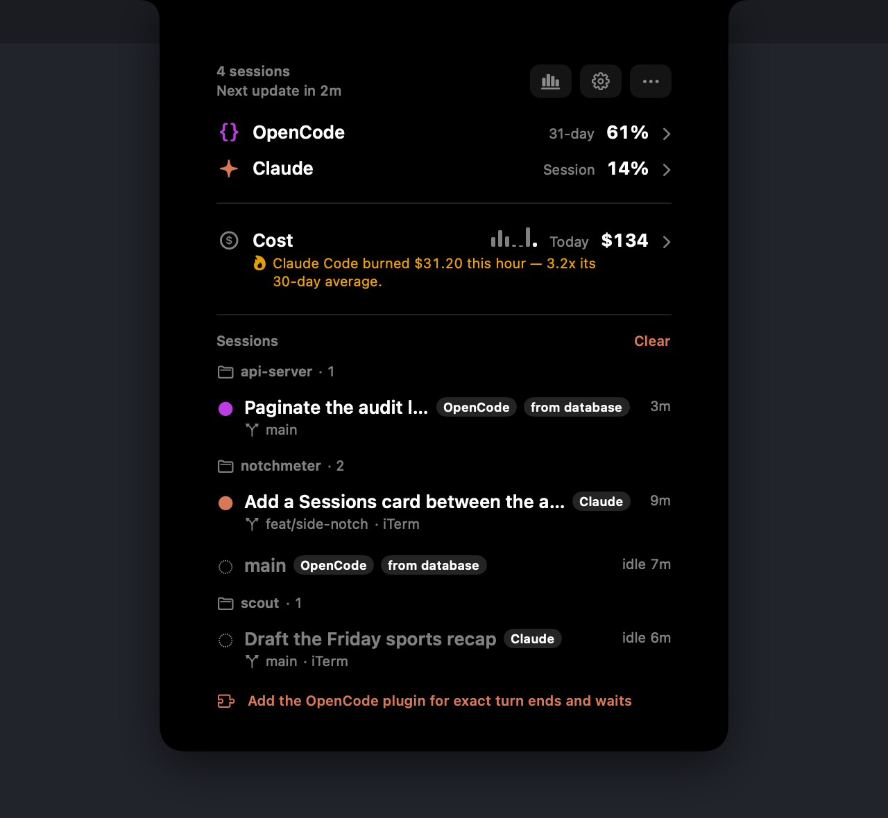
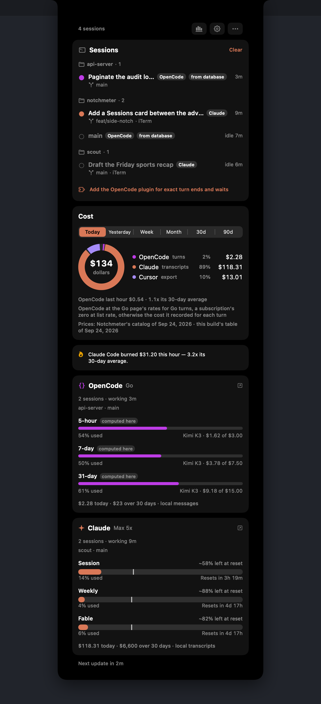
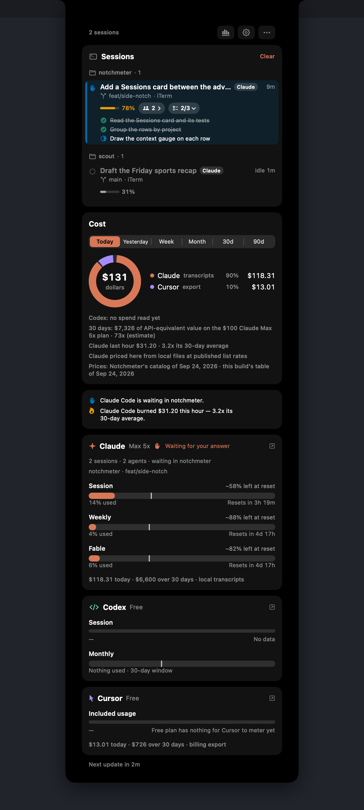
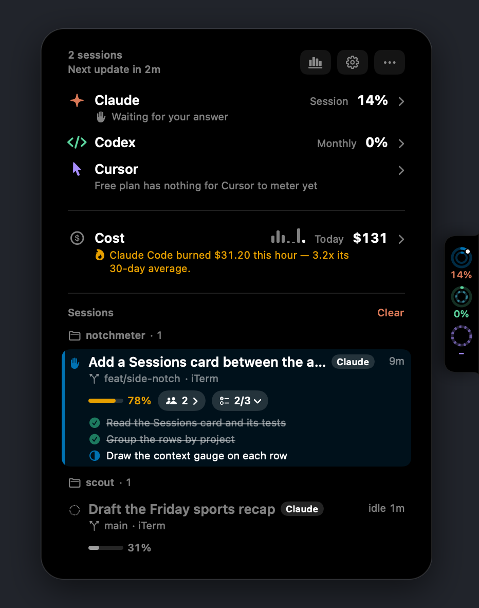
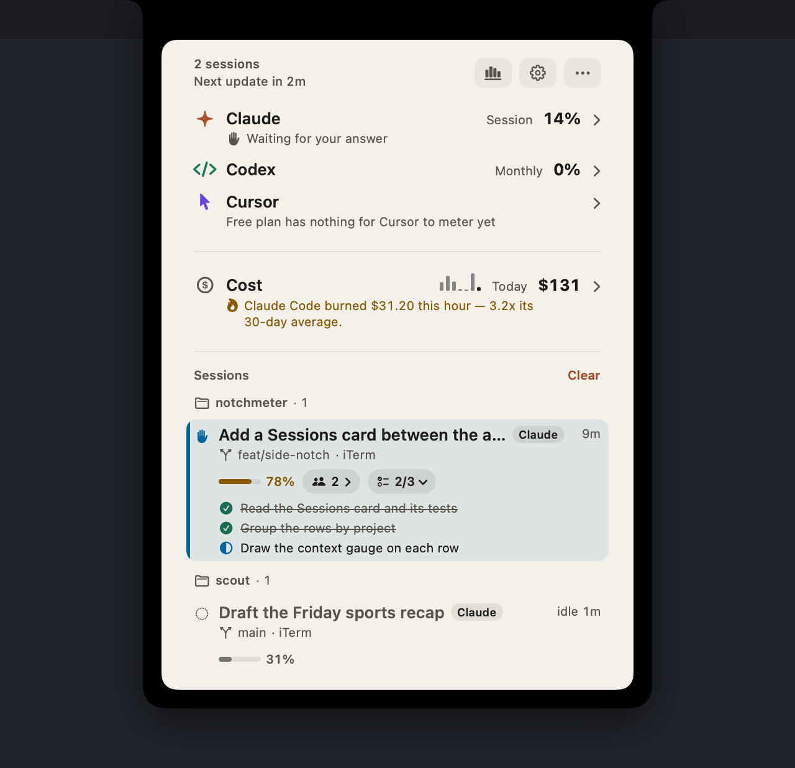
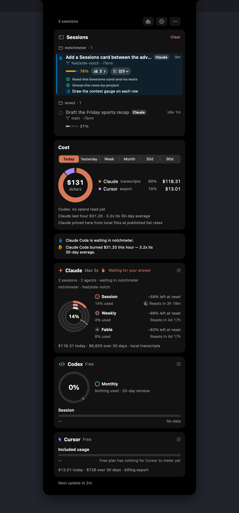
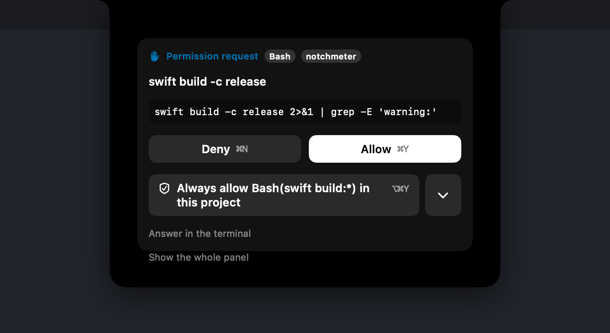
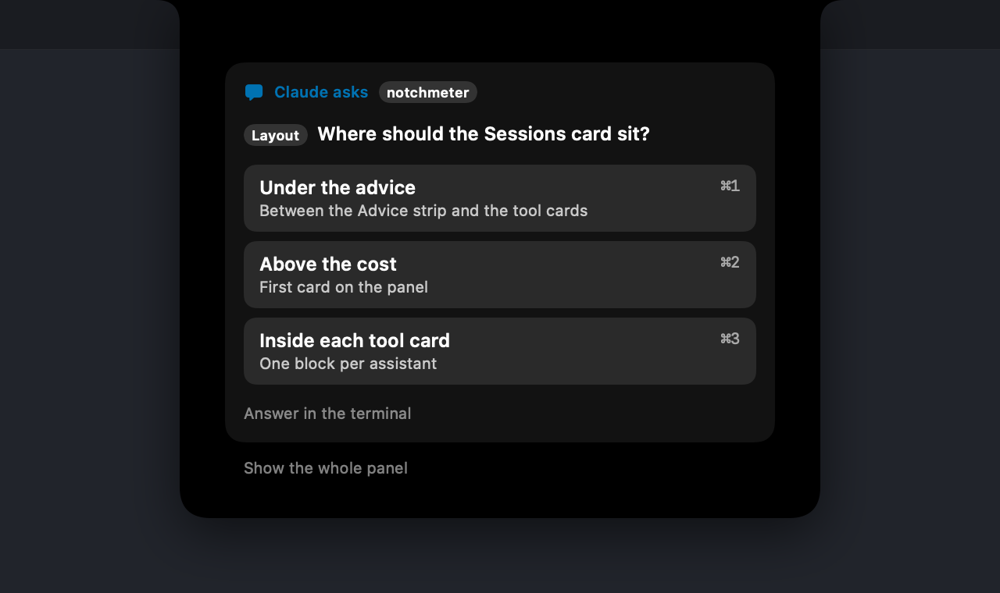
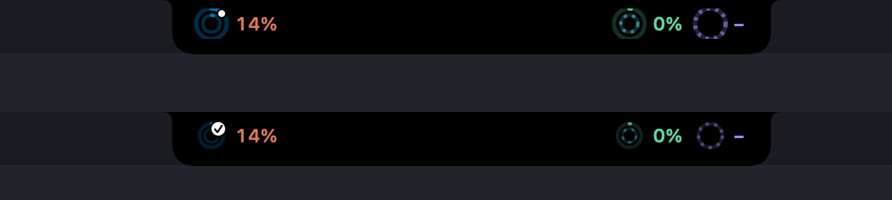
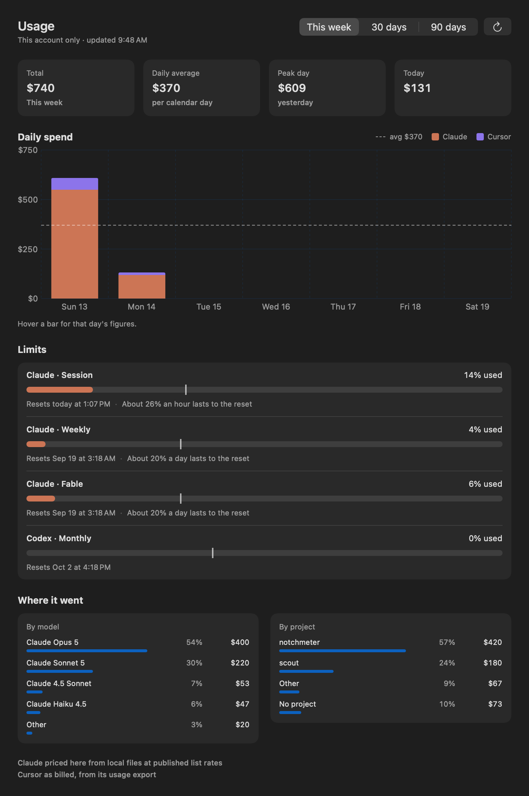

# Features

What each meter shows, the pictures, every setting, the command line and the agents' tools, the languages and the advice rules, in full. The [README](../README.md) has the short version, and the [guides](https://www.notchmeter.com/guides/) on the site (sources in [`site/guides/`](../site/guides)) take the common questions one at a time: the cost estimate against the bill, running out before a reset, which assistant should get a task, notifications, the prompt cache, the three vendors' limits, monitoring without config writes, and the other apps in this space.

## The meters

- **Claude Code** — the 5-hour session window, the weekly window, and the per-model weekly limits Anthropic publishes (Fable, Sonnet, Opus…), plus what your local Claude Code sessions would have cost at API list prices: today, yesterday, and the last 30 days, with a 30-day trend.
- **Codex** — the session, weekly or monthly rate-limit windows from the same backend Codex itself asks, with the snapshots Codex writes into session rollouts as a fallback when offline.
- **Cursor** — included plan usage and on-demand spend for the current billing cycle, read the way cursor.com's own dashboard reads it, plus the Grok Bot weekly allowance on a seat that has one. On a seat the summary meters nothing for (an Enterprise seat billed on-demand), the dashboard's own cycle figures are asked for and their included spend fills the ring; where those carry nothing either, *Today's spend* measures today's dollars from Cursor's usage export against your usual day instead. The two model meters Cursor still answers for such a seat read 0 % whatever it spends, so behind *Today's spend* they carry no figure, and rings set to them move to the spend window until a meter counts.
- **Gemini CLI** — the per-model quota Google meters for Gemini CLI (Gemini Pro, Gemini Flash, Gemini Flash Lite, and any Claude or GPT model the plan covers), from the same Code Assist endpoints Gemini CLI's `/stats` reads, asked under Gemini CLI's own identity on whichever of Google's two deployments meters the account, with the Google login Gemini CLI keeps on this Mac. Its own ring, card and hook since 0.9.0; until then it shared Antigravity's. A personal Google account, which Google stopped serving here in June 2026, reads as a calm row saying so, hidden by *Hide assistants with nothing to show*, rather than as an error.
- **Antigravity** — the session and weekly quota Antigravity's own panel shows for its two model groups, asked under Antigravity's identity on the deployment its CLI logged, with the same Google login (the app keeps its own in the Keychain). Shown when the app, its home folder or its CLI is on this Mac; a Mac with only Gemini CLI shows only the Gemini row, and one with both shows both, since Google can hold a different licence for each ([docs/accuracy.md](accuracy.md#gemini-cli-and-antigravity-quota-and-no-cost)).
- **GitHub Copilot** — the AI-credit allowance for the month on a seat GitHub bills by usage (the premium-request allowance on a legacy seat, and the chat and completion quotas when a plan meters them, Copilot Free's included), from the endpoint Copilot's own editor plugin asks, with the token that plugin (or `gh`) keeps on this Mac; the credits used, a cent each, join the Cost card.
- **Kimi Code** — the rolling five-hour window, the week (on memberships that still have one) and the monthly pools, from the endpoint Kimi Code's own CLI reads for its `/usage` command, with the login that CLI keeps in `~/.kimi`. Where Kimi's two shapes of answer disagree about one window, the window is as spent as the furthest-along figure says, and the counts are printed under the bar ("61 of 200 left") so the disagreement stays visible; Moonshot publishes no plan sizes, so a window without a limit has no figure ([docs/accuracy.md](accuracy.md#kimi-code-an-allowance-two-shapes-of-answer)). The login is read and never refreshed, so when the CLI has not run for a while the card says to run it once and keeps the last reading meanwhile. A kimi-cli set up on a Moonshot API key, with no Kimi Code login, is a calm row too: nothing to meter, nothing wrong.

When 0.9.0 first runs on a setup from an earlier version, the Gemini CLI row starts with everything the combined Antigravity row had — switched on or off, its place in the order (just before Antigravity), its pin beside the menu bar, peak hours, which windows its rings show and hide — and Kimi Code starts switched on; each is done once, so a later choice is never undone.

- **OpenCode** — with nothing to sign into and nothing to install, read from OpenCode's own database on this Mac, never written: what its turns cost (OpenCode Go turns at the Go page's rates, every other turn at the cost OpenCode recorded for it, a subscription login's turns at Anthropic's or OpenAI's list rate) on the Cost card, its sessions on the Sessions card, and on the Go plan a **5-hour, 7-day and 31-day meter computed here** from this Mac's own turns, because Go publishes its limits (dollar amounts per model: 20 %, 50 % and 100 % of a monthly limit of $15, $30 or $60) but no reading of them. Each Go window is a trailing one named by its length, is tagged *computed here* (the tag's tooltip says the figure can read higher than Go's own console and never lower), names the model closest to its limit ("Kimi K3 · $1.62 of $3.00"), and keeps a hidden window per model; a model the page gives no limit shows its spend with no bar. Under Assistants the row reads *Go · computed from this Mac's turns*, not *Signed in*. The rules, the page's prices and limits and the date they were read are in [docs/accuracy.md](accuracy.md#opencode-its-own-records-and-a-go-meter-computed-here).

Every meter shows a pace tick (where an even burn would be right now), a projection ("~67% left at reset" or "Runs out in 2h"), and the reset time as a countdown or an exact time.

| | |
|---|---|
|  |  |

*OpenCode with nothing installed. Left, the Simple panel: the Go figure, the Cost row, and a session read from OpenCode's own database, marked as such. Right, the Detailed panel: the Go meter's three trailing windows, each tagged* computed here *and naming the model closest to its limit.*

The rings follow a calm rule ([`Presence.swift`](../Sources/Notchmeter/Presence.swift)): small and dim while every window is under 40 % and on pace, full size once one passes 40 % or runs close to its pace (a ring keeps its assistant's colour however full it gets; the figure beside it and the cap on its end say how close it is; an assistant's second and, when chosen, third rings take companion colours near its own, Cursor's pink and periwinkle inside its purple, so they can be told apart, and none of them is a status colour), and slowly pulsing once one is behind pace, has run out, or an assistant is waiting for you. With an assistant's hook installed and none of its sessions running, its window on pace stays quiet however full it is, and *Hide when idle* shrinks the rings to a dot after 30 quiet minutes. Status never rests on colour alone: pace notes carry a symbol and the rings a cap, a waiting assistant a filled white dot and one that has just finished the same dot with a tick, the status colours are Wong's colour-blind-safe set, every meter has a VoiceOver label, Reduce Motion (or the app's own Reduce animations) is honoured, Increase Contrast brightens the tracks and Reduce Transparency swaps glass for black, and on macOS 26 the edge layouts' floating pill is Liquid Glass, as is the card the panel opens in until another material is chosen (see [Themes](#themes)). The notch cut into a side edge is deliberately never translucent: a shape whose whole claim is to be a hole in the screen cannot have the wallpaper reading through it, so it stays opaque black and always in the dark appearance. The notch layout's panel is opaque black too unless Glassy or Smoked is chosen, and even then the band the hardware notch sits in stays black, so the panel still reads as one shape hanging from the notch; it draws its own blur and tint rather than Liquid Glass, which over that black rendered pale grey.

**Usage Dashboard** (Options menu, ⌘U, or the Dashboard tab in Settings): the account's spend and limits in one window, so the week's shape is read rather than guessed. Total, daily average, peak day and today for this week, 30 or 90 days; the value line under the tiles; daily spend stacked by assistant; every live limit with its pace tick and how much a day (or an hour, for the session) lasts to the reset; spend by model and by project; and a line under each saying where the figures came from. It reads only what this account's Notchmeter already holds: nothing is fetched for it, and nothing is shared with any other account on the Mac.

**The value line.** Under the Cost card's legend, on the Simple panel's Cost row when no money advice takes the line, and under the dashboard's tiles: *"30 days: $412 of API-equivalent value on the $200 Claude Max 20x plan · 2.1x (estimate)"*. The range's spend, which on a subscription is what the same work would have cost at API list price, against what the spending assistants' plans cost over the range, from the prices the vendors publish ([docs/accuracy.md](accuracy.md#plan-value), with the table and the day it was read). A range shorter than a month has no fee of its own, so its line is the thirty days'; ninety days stand against three months of fees only where the records reach that far back; a plan whose price is not published gets no ratio, never a guess. Hidden with the Cost card while the screen is shared.

**The usage card** (*Share usage card…* in the Options menu, in the Cost card's menu, and the share button on the Usage Dashboard) turns the figures into a picture to post. The headline is the API-equivalent value, or the tokens, for today, 7 days, 30 days, this month or 90 days, with the ×-plan ratio where it can be made; under it a running total stacked by assistant and a total per assistant, every metered assistant on one card or the ones you tick; one line drawn from what really happened in the span (a limit window that peaked, else the busiest day, [docs/accuracy.md](accuracy.md#the-usage-card)); the Notchmeter wordmark and notchmeter.com; and the words "API-equivalent estimate, not a bill". Feed (1200×1500), square (1080×1080) or story (1080×1920); White, Black or Blue, chosen from the metric (money on black, tokens on blue) until you pick one; an optional signature line of forty characters. The window shows the card at actual size, one pixel a pixel, and the ways out are the system share sheet, *Save PNG…*, *Copy image* and *Copy caption* (the card in words, for the post). Never a project name, a prompt or a session title, and nothing is fetched to make it; while the screen is shared the preview and the buttons wait. Once per version, after an update, the window opens by itself with the last thirty days when they hold at least a week of use, and never while the screen is shared, a full-screen app has the display or another of the app's windows is up; it opens without taking the keyboard from whatever you are typing in, and opening the card yourself first counts as the offer made. *Don't offer after updates* in that window, or *Offer the usage card after an update* in Settings › General, ends that for good. When every assistant is unticked, the preview says so in the card's place rather than claiming nothing was recorded. `--render-assets` draws the formats and themes, two of them in German and Russian, into `share-cards/` under its output folder for review, with the studio itself once with the after-update banner and once with nothing ticked.

Every other meter tells you how much. Notchmeter also tells you what to do about it: an **Advice** strip under the Cost card, and a notification when a window's pace crosses, both worded as an instruction rather than a percentage. See [Advice and notifications](#advice-and-notifications).

With the optional [hooks](hooks.md) — one each for Claude Code, Codex, Cursor, Gemini CLI, GitHub Copilot CLI and Kimi Code, and a plugin for OpenCode — the notch refreshes the moment a turn ends, counts the sessions you have running ("2 sessions · working 2m 10s"), and shows a dot on the ring (with a count past one) while an assistant waits for your permission or your answer in some project, or a tick for the minute and a half after a turn ends. Claude Code, Codex, Gemini CLI, Copilot and OpenCode document an event for a wait, so their rings can show the dot; Kimi Code documents none, so its ring shows the tick and the session count only; Cursor documents none either, so its ring shows the tick and the session count, and since 0.7.6 a Cursor turn that goes 45 seconds without activity and with no command running is shown as a *possible* wait (it may be an approval Cursor is asking for in its own window, or a slow model step); that is Notchmeter's inference, not a Cursor event. Since 0.7.0 a Claude Code wait is answerable as well as visible: the panel shows the permission request (the tool, a one-line summary and an excerpt of what it wants to do) or the question with its options, with Allow, Deny and the options as buttons and shortcuts (and, when Claude Code suggests a rule, *Allow always* saying it in plain words, such as *Always allow Bash(npm test:\*) in this project*, which allows the call and saves that rule; ⌥⌘Y), a **Sessions** card lists every running session with its title, its terminal and its elapsed time, and clicking a session jumps to that terminal; [docs/hooks.md](hooks.md) has what the hook sends for it, the hold, and the fail-open rule. The ring takes the blue that means *needs you, not running out* with it, while the cap on its end keeps saying that a window is nearly gone; you can turn the colour off in Settings without losing either mark. With the optional [status line](hooks.md#the-status-line), a thin arc around the Claude ring shows how full the session's context window is, the card says "Context 62% · Opus · $1.23 this session", and the official session and weekly figures come from Claude Code itself, so the endpoint is not asked at all while a session is running.

**The Sessions card** is the richest part of the panel. Each row has the session's title in a larger semibold line with the assistant's chip, and under it the git branch (the branch symbol), the terminal or editor it runs in, and `@host` for a session on another machine; the whole row is the jump to its terminal where there is one. The row that needs you (a wait, or a request held for your answer) sits on a blue wash with a bar down its leading edge as well as the hand in its status mark; under Increase Contrast the wash is stronger, and the hand, the bar and the checklist's marks turn white so they stay above 3:1 on it. With more than one project live the rows sit under a small header per project, "notchmeter · 2" (a row with no title of its own then takes its branch, else its terminal, as its title rather than repeating the header, and the header carries the host), the projects in the order of their most urgent row and the rows worst first inside each (waiting, working, just finished, idle), so grouping never puts a wait below something that is only working. Under the two lines sit what the session carries, each only when something reported it: a context gauge with its percentage from the session's own status line (nothing for a session that has not reported one; never estimated), a subagent chip with the count that opens to list each running subagent and how long it has run, and Claude Code's task list as "2/3" that opens to the checklist (done, in progress, not started, by shape as well as colour). The task list comes from Claude Code's `TaskCreate` and `TaskUpdate` tools (or `TodoWrite` on older builds) through the hook ([docs/hooks.md](hooks.md#the-task-list)); a task with no words is listed as *Untitled task*. The card draws four, six (the default), eight or ten rows before it counts the rest as "+3 more" (*Sessions shown at once*, Settings › Assistants › Sessions), and *A row leads with* picks the first line: the conversation's title, with the project, branch and terminal under it (the default), or the project, with the title opening the second line; under a project's header the branch leads instead, since the header already names the project, and a row with no title of its own leads with where it runs either way. Since 0.11 Claude Code's hook adds more to the line ([docs/hooks.md](hooks.md#the-events-011-added)): a *Compacting* chip beside the gauge while a compaction runs (in the warning orange, its symbol breathing unless motion is reduced), then a quiet count of the compactions done, with the gauge withdrawn until the status line reports the fill that is left; the model the session runs on, named as the status line names it and opening onto the switches that got it there, a fallback Claude Code made by itself with its own symbol (drawn only where it says something: on a row that has heard a switch, or when the rows run on different models, since the status line names every Claude row's model and a line of chips all saying the same thing told the rows apart by nothing); *2 idle* for the teammates of an agent team that finished their turn, opening onto their names (numbered while titles are hidden), on the row of the session whose id the `TeammateIdle` payload carries, which the reference does not say is the lead's rather than the teammate's own ([docs/hooks.md](hooks.md#the-events-011-added)); and a count of the tool calls auto mode refused this turn, opening onto each tool and the kind of refusal. The second line says *worktree* while the session runs in a git worktree. Under them, the row names an MCP server that wants input only the terminal can give (*linear asks for input: answer in the terminal*), and a run of five failed tool calls with none succeeding between them as *May be stuck: 5 tool calls failed in a row*, in the warning orange with a symbol of its own. The chips wrap onto a second line rather than run past the card on a narrow panel. An idle row is not dimmed, so its text stays readable; its hollow ring and grey title mark it idle. Its words are held under *Show what a session is working on*, like titles: off, or while the screen is shared, the chip shows the count and opens nothing. Every mark, clock, gauge and chip has a tooltip and a VoiceOver label, the disclosures announce whether they are open, and nothing is reachable only on hover. With a hook installed and nothing running the card stays, with one quiet line (*No sessions right now*), rather than disappearing; *Show a Sessions card on the panel* still turns it off. OpenCode's sessions appear with nothing installed, read from its own database; each such row carries a *from database* chip (its tooltip says a turn's end shows a few seconds late and a wait for your permission not at all), and under them one line offers the plugin, *Add the OpenCode plugin for exact turn ends and waits*, which opens Settings › Integrations (or, with the plugin already there, says OpenCode switches to it when it next starts).

**Sessions before any hook** (0.9.0). The card does not wait for a hook to be installed: *Find sessions without the hook* (Settings › Assistants › Sessions, on by default) lists the Claude Code, Codex, Cursor, Gemini CLI and Copilot sessions running in a terminal from the first launch, from the process, its folder, Claude Code's own session files and the end of its transcript, all read and never written. Such a row has the title Claude Code gave the session (only while titles are on and never while the screen is shared), the project, the branch on its second line ("feat/zero-config · iTerm"), the model chip where the rows' models differ, the elapsed time, a working-or-idle guess and the jump to its terminal, and a quiet dashed *detected* mark beside the assistant's chip whose tooltip says that its working is a guess that can trail the turn by a few seconds and that a wait for your answer is not shown (VoiceOver reads the row as *Found without the hook* with the hint *Working is a guess, and a wait for your answer is not shown without the hook*, and the status mark's tooltip says *Working, as far as the running process and its files show*). A detected session never raises the waiting hand, a notification or news in the notch, never lights the *just finished* tick and never holds the Mac awake. A session only Claude Code's status line has reported (the Welcome flow installs the status line even when the hook is declined) is such a row too: it keeps the status line's model, name and context gauge, takes the scan's working or idle, and wears the same mark. While any such row's assistant has no hook installed, the card ends on one line, *Install the hook for exact turn ends and answering from the notch.*, with an *Install the hook…* button that opens the hook's own install flow in Settings (nothing is written until you press Add there, after the usual backup). The hook's first event for a session takes its row over, and a session the hook reports is always the hook's. The scan runs every 3 seconds while an assistant is running and every 15 while none is, twice as long on battery, and not at all while nobody can see the screen; [docs/hooks.md](hooks.md#sessions-found-without-the-hook) has what is read and [docs/accuracy.md](accuracy.md#sessions-found-without-the-hook) what the guess can and cannot know. `--render-assets` draws the first launch as `expanded-detected.png`, with the card alone as `sessions-detected.png` and under Increase Contrast as `sessions-detected-contrast.png`, for review.

**Claude Cowork's tasks** (since 0.9.0) sit on the same card with no hook and no setup. Cowork runs inside the Claude app and has no hook, so while the Claude app is running Notchmeter reads the files it keeps for each task, read-only, every five seconds (ten on battery, fifteen while no task is listed, thirty while the screen is locked): the task's title, the folder you gave it (its row's project and group), and the task's own log. A row carries a **Cowork** chip, whose tooltip says it was read from the task's log and can never show a wait, and takes the Claude colour, because a Cowork task spends the Claude plan. It is working from its prompt until the log's own end-of-turn line, and that line is its finish: the green tick, the Claude ring's finished mark, the *Finished* news beside the notch and the *Notify when a turn finishes* banner ("Claude Cowork finished a 7m turn in Support") all come from it, with the turn's length as the log states it. A task whose log has been quiet for four minutes, or that has stopped to ask you something in Claude, shows as idle, and so does a task just made, until its first prompt is written; it is never shown as waiting for you, and a turn that went quiet is never claimed as finished. Clicking a row brings the Claude app forward (Notchmeter cannot open one task in it), *Clear* sets idle tasks aside until they write again, a task leaves the list thirty minutes after its log last moved or when it is archived, and every Cowork row goes the moment the Claude app quits. The title is held only while *Show what a session is working on* is on (switching it off drops it everywhere at once) and is hidden while the screen is shared, like a prompt's first line. A working task holds *Keep the Mac awake while an assistant is working* too. Settings › Assistants › Sessions › *Show Claude Cowork tasks* (on by default) turns all of it off; the Cost card's Cowork spend, which comes from the same logs under the project "Cowork", is unchanged either way. The rule, its source and the measurements behind its four minutes are in [accuracy.md](accuracy.md#claude-coworks-tasks). `--render-assets` draws a panel with two Cowork tasks, one working and one just finished, in `cowork.png`, and the notch announcing the finish in `cowork-news.png`.

**News in the collapsed notch.** With a hook installed, the strip beside the notch announces a session that starts waiting for you or finishes a turn longer than twenty seconds, and since 0.11 one of Claude Code's that starts compacting its context by itself, may be stuck, or is refused a tool by auto mode for the first time in a turn: for four seconds it names the project on the left of the notch and the reason on the right, each with a symbol (*Needs approval*, *Question*, *Needs input* for an MCP server, *Waiting for you*, *Finished*, *Compacting*, *May be stuck*, *Blocked*), in the room Auto measured either side of the notch (at most 150 pt a side, and never under the notch itself; with a fixed side, the same 150 pt). A side too narrow for words gives them to the other; with no room on either side there are no words, and the glow and the rings carry the news. Clicking the words, or resting the pointer on them under *On hover*, opens the panel on that session: on its request card when the hook is holding one, otherwise on the session's own card with the link to the whole panel. The same session for the same reason is not announced again inside thirty seconds, and a wait on screen is not replaced by a finish or by trouble. Under it, a glow spills from the notch's edge: a blue bloom for a wait, a white one for a finish or trouble, fading after three seconds, with a faint blue kept under the notch while any session still waits. The glow is drawn in its own window that ignores the mouse, so it never takes a click. While the screen is shared the words carry the reason alone, with no project. VoiceOver hears the news as an announcement, and the words are a button it can press. Under Reduce Motion the words crossfade in place of the strip's slide and the glow is a still tint. Settings → Notifications has *Show news in the notch* and *Glow under the notch for news*, both on by default; the top layout on a notched Mac draws them, and the edge layouts keep their readouts. `--render-assets` draws the three states in `review/notch-news.png`.

**Assistant symbols in the rings.** *Show assistant symbols in the rings* (Settings → Appearance, off by default) draws each assistant's own symbol, the one on its card, in white: in the middle of a single ring, and beside the rings when there are two or three, whose hole is too small to read it in. It never sits over a ring, so no arc's end or pace cap is hidden, and it keeps its place as the rings go quiet or wake. It is for when the assistants' colours are hard to tell apart.

**What the closed notch shows.** Settings › Appearance has two choices for the notch layout, *While an assistant works* and *When nothing is running*, each one of **Rings or numbers** (the readouts as *Beside the notch* sets them, the default for both, which is the strip as it has always been), **Assistant symbols** (each assistant's symbol in its own colour, with a bar under it while one of its sessions works, a small hollow ring under it while its sessions idle, and the rings' own marks on its corner for a wait or a finished turn; in grey with nothing under it while no session of it is known, so idle and absent differ by shape and not by colour alone), or **Nothing** (the notch alone, which still opens the panel on hover). Working means a session the hooks report is working, waiting for you, holding a request, or has just finished a turn the ring still ticks for; the phase lasts five seconds past the last of that, so a quick turn and the next prompt do not flip the notch between modes ([`ClosedNotch.swift`](../Sources/Notchmeter/ClosedNotch.swift)). Without a hook nothing is known to be working, so the notch stays in its quiet mode. Nothing gives way to the readouts while a window is behind pace or out (the rings' urgent level), so a limit running out is never hidden. The news peek and the glow are unaffected. Nothing in the symbols mode moves: the strip is on screen all day, and an animation without end would redraw it every frame. The edge layouts and the pill keep their readouts, since an empty capsule on the desktop would be a stray shape. `--render-assets` draws the three modes while a session works, the symbols while every session idles, and a ring just scrolled onto another window, in `closed-notch.png`.

**Scroll a ring onto another window.** Resting the pointer on an assistant's readout and scrolling sideways with two fingers, or turning a mouse wheel, moves its outer ring to the next of its windows that has a figure (the session, the week, a model's week, the month, and *All models* where there is one), wrapping at the end; if an inner ring was showing that window the two swap, so the nest keeps its count. One gesture is one window: a trackpad swipe steps once it has travelled 24 points and its momentum steps nothing, and a wheel steps once per spin. A vertical two-finger swipe stays the gesture that opens the panel, and is the ring's too only while *Gestures* is off (or Reduce Motion is on). A label under the ring names the new window for 1.4 s ("Weekly · 62% used", with the source tag the card would show, such as *inferred*, and no figure while the screen is shared), in a click-through window of its own that fades in over 200 ms and out over 150 ms, or comes and goes without a fade under Reduce Motion; VoiceOver hears the same words. The choice is the one each assistant's **Options** under Settings › Assistants makes with its ring pickers, and is kept the same way. VoiceOver reaches it without a pointer: a readout with more than one window to show is adjustable, increment for the next window and decrement for the previous, and its value then leads with the window the ring shows ([`RingRetarget.swift`](../Sources/Notchmeter/RingRetarget.swift)).

**The last seven days.** The Simple panel's Cost row carries a strip of seven bars beside its figure, today's the brightest: today and the six days before it across the assistants the Cost card carries. Resting the pointer on the row names each day, newest first, with its total and, on a day more than one assistant spent, the split ("Sep 22 · $548 · Claude Code $494, Cursor $54"); opening the row draws the week as a chart, each day's bar stacked by assistant in their own colours with the day's initial under it and "Today $131 · 7 days $1,984" over it, so nothing about the week is only on hover. The Detailed panel's Cost card draws the same chart under *Show details*. VoiceOver reads the week's headline with the row and every day, with its split, on the chart. It is the Cost card's own per-day data in the card's own unit (tokens under Tokens; dollars under $/MTok, since a rate has no height to give a day), gone with the card while the screen is shared ([accuracy](accuracy.md#the-last-seven-days)).

Notchmeter never signs in anywhere and never stores a token. Each reading is borrowed from the tool that owns the account; switch accounts in that tool and the notch follows.

## Screenshots

| The open panel (Simple) | The same panel, Detailed | The left edge | The right edge, panel beside it | Settings |
|---|---|---|---|---|
|  |  |  |  |  |

| Paper | Gauges and the hour clock |
|---|---|
|  |  |

| Answering a permission request | Answering a question |
|---|---|
|  |  |

*A request opens the panel on its card and nothing else, with one link to the rest of the panel. The terminal shows its own prompt at the same time, so whichever you answer first wins; Escape, or* Answer in the terminal, *hands it straight back. See [docs/hooks.md](hooks.md#answering-from-the-notch) for what the hook sends and how every part of it fails open. Since 0.11 an MCP server's request for input opens the same way when every field of its form is a choice, one button per value; one that wants text or a sign-in is left to the terminal at once ([docs/hooks.md](hooks.md#answering-an-mcp-server); `--render-assets` draws the card in `elicitation.png` for review).*





*The Usage Dashboard over the same fixed readings. The week runs from the moment the Claude weekly window opened, so its bars add up to the Total; the tick on each limit is where an even pace would be now.*

*The same strip a moment apart. Above, Claude Code is waiting for an answer: the rings take the blue that means needs you rather than running out, and the white dot on the corner of the Claude readout says which of the two states it is. Below, a turn has just ended: the same blue at its quiet level, a tick in place of the dot, and the rings back at their quiet size, because a finish is news rather than a block and never makes the readout louder.*

The pictures are drawn by `Notchmeter --render-assets docs/media` (and the dashboard by `--render-dashboard`) from the real views over fixed readings and a fixed set of hook events (the OpenCode pair above from a second fixture, OpenCode on Go with no plugin installed, whose every figure comes from synthetic turns run through the same code) — Claude on Max 5x an hour and forty minutes into a quiet five-hour session, so a third of it gone by the clock and 14 % of the allowance gone with it, two Claude Code sessions open and one of them waiting on a permission prompt, Codex and Cursor on free plans — not from a live account, so they come out the same on every build and show nobody's usage. For review, the same run draws the rows 0.9.0 added on a Mac of their own (`assistants.png`, `assistants-compact.png`, `assistants-detailed.png` and `assistants-contrast.png`): Gemini CLI on a Standard seat with a session held on a tool permission, Antigravity on Google AI Pro, and Kimi Code with its five-hour, weekly and monthly windows and a turn running. It also draws the edge pill under the Light appearance for both fixtures (`pill-light.png`, `assistants-pill-light.png`), the one surface where the identity colours take their light values.

## The welcome tour

The first launch opens a four-step tour, and **Settings › General › Show the welcome tour again** opens it again at any time. Each step is a preview of the real views drawn from sample data, the same fixtures the pictures above come from, and labelled **Sample data** so nobody reads it as their own usage. The previews take no clicks and VoiceOver reads each one as a single item named for its step.

1. **The rings beside the notch.** The compact strip with a turn running and nothing asked, so no ring carries a mark yet. This step also says what the app reads and what it never sends, and explains the Keychain and Accessibility prompts beside the rings that need them.
2. **The panel, and pace.** Claude's card, and the two pace states the way the ring's cap, the card's symbol and its words show them (*Cutting it close*, *Will run out*). State never depends on colour alone.
3. **Sessions, answered from the notch.** The Sessions card beside a permission request, and the Automation prompt that jumping to a terminal needs.
4. **Connect Claude Code.** The waiting hand and the finished tick as the hook lights them, and the same **Install the hook and status line…** button as before. It opens Claude Code's own page in Settings, where the hook and the status line are, and which backs the file up first. If both are already installed, the step says so and the button becomes **Open Claude Code in Settings…**, since there is nothing left to install. On a Mac with OpenCode, a row under the button says OpenCode needs nothing installed (its sessions, spend and Go plan are read from its own database) and that its plugin, on OpenCode's own page in Settings, adds each turn's exact end and its waits.

Back, Next (Done on the last step) and Skip sit under the step. The dots between them go straight to a step, and the current dot is a wider bar, so it is marked by shape and not only by colour. ← and → move one step, and → stops at the last step instead of closing the tour. Return is Next, and Escape closes the tour. Pages slide from the side you are heading towards, the new one easing in over a quarter of a second while the old one leaves a little faster. Under Reduce Motion (the system's setting or *Reduce animations*) they are replaced with no animation. `--render-assets` also writes `review/welcome.png`, all four steps one under another, for review.

## Themes

Settings › Appearance › **Theme** makes the open panel yours, with a live preview over sample data at the head of the section; every choice applies to the panel at once. The strip beside the notch, the news and the glow are untouched, since they are drawn on the notch's own black.

- **Surface: Black · Paper.** Black is the panel as it has always been. Paper is the notch inverted: the black stays round the panel as a bezel and a frame (the band under the notch, 15 points either side and below, six in an edge layout's card), and the sheet inside is off-white, #F4F1EA, with near-black ink — the figures printed rather than lit. Every colour on it is its printed counterpart in the same hue: the assistants' colours, the status colours and the accent, darker. Shown in `theme-paper*.png`.
- **Material: Glassy · Smoked · Solid.** How much of the desktop shows through the open panel, blurred. Glassy lays black at 80 % over the blur and Smoked at 90 %; Solid is opaque. Those two figures are the least black at which every line still reads at 4.5:1 with a white window behind the panel (a white window through an 80 % tint is #333333; the panel's own shadow only darkens it further). The band the hardware notch sits in stays black. Until one is chosen each layout keeps what it drew: the notch's panel solid, and from macOS 26 the card an edge layout opens in Liquid Glass, which is Glassy with the tint now under the text. Paper is always solid — dark figures on a sheet the desktop shows through would lose their contrast over a dark window — and so is every panel under Reduce Transparency or Increase Contrast, as macOS draws its own.
- **Accent: Terracotta · Teal · Lilac.** The app's own colour: the chosen range on the Cost card, the line that says a session is waiting for your answer, Clear, a card's signal label. Terracotta, the icon's colour, is the default. Teal (#4CC3B6) and lilac (#B6A4F7) were chosen by measurement: 8.5:1 or better as text on a card, better than 9:1 for black text on their own pill, and under simulated protanopia, deuteranopia and tritanopia at least 23 ΔE from the warning orange, the vermillion and the "needs you" blue and at least 30 from terracotta and from each other (terracotta is 14 from the orange, which is why a colour-blind reader may prefer either of the others). The choice is a radio group, each option its swatch and its name, so it is the same control as the pickers round it: VoiceOver reads it as one group, the arrow keys move between the options, and the radio marks the choice rather than the colour. Under Increase Contrast the accent is lifted on the black panel (#E8A084, #8ADBD2, #D3C8FB) and darkened on Paper (#7A3219, #0F5650, #4A37A0) so the text on the selected pill clears 7:1 on either face.
- **Usage style: Bars · Gauges.** Bars is a meter per window. Gauges draws an assistant's windows as rings nested in one dial, outermost first in the card's order — the nest beside the notch, larger — with the pace tick across each ring and the most urgent figure in the middle. Each row beside the dial leads with a small nest marking which ring is its own, so position says it as well as colour; a window past the third, or with no figure, keeps its meter, and every line under a window stays. On the Simple panel each row carries a small dial beside its figure, without the pace ticks (at that size a tick reads as a line struck through the rings; the pace is in the row's own words and colour) and not at all while every ring would be empty, since a bare track beside "0%" reads as a spinner. The dial, the legend swatches and the clock are sized relative to the text beside them, so they keep their proportion to the rows at whatever size the text is drawn.
- **Draw hour limits on a clock.** A window shorter than a day, such as the five-hour session, gets a small clock beside its reset on the card — and so on the Simple panel once a row is open onto its card; the closed row names no reset for a clock to stand beside: the hand is where the window stands, and the filled part from the hand round to twelve is the time left; a full clock is a window that has not started, and a reset already past draws no clock, as it draws no pace tick. Longer windows keep their words. [docs/accuracy.md](accuracy.md#dials-and-the-hour-clock) has the rule.

Contrast holds for every combination. A colour moves in lightness alone, by the least that makes words read at 4.5:1 and marks at 3:1 on the sheet (for a translucent material, the sheet over a white window), on a card and on the "needs you" wash (`PanelLook`); `ThemeContrastTests` audits every colour, material, accent and Increase Contrast, and fails on any pairing short of its mark. On the black panel that moved only words that never reached 4.5:1 — the "needs you" blue in a request's title (4.0:1), the finished green (4.0:1), the vermillion on the wash, and under Increase Contrast the accent on the stronger wash — and left every ring, meter and glyph as it was. VoiceOver reads the preview as one item naming the look, and the accent as a radio group with its options. The preview is drawn at the panel's own width (*Panel width*), so its sample rows wrap and truncate exactly where the panel's would. `--smoke` prints a `theme:` line with the look and its weakest pairing, the oracle's snapshot carries the choices and the resolved `look`, and `--render-assets` writes `theme-paper.png`, `theme-paper-open.png`, `theme-paper-detailed.png`, `theme-paper-gauges.png`, `theme-paper-contrast.png`, `theme-paper-edge.png`, the three materials over a desktop running into a white window (`theme-glassy.png`, `theme-smoked.png`, `theme-solid.png`), `theme-accent-teal.png`, `theme-accent-lilac.png`, `usage-gauges.png`, `usage-gauges-simple.png` and `usage-clock.png`, each followed by a `contrast` line with the look's weakest text and mark, and `settings-theme.png`, the Theme section with Paper, teal, the dials and the clock chosen, its preview drawing them.

## Layout and settings

The panel has two layouts, chosen under Settings › Appearance › *Panel layout*. **Simple**, the default for new installs and for everyone who never chose, is one sheet with no card boxes: a row per assistant with its glyph, its name and one figure, the most urgent of its windows (the one furthest behind pace, else the most used) in the Used or Left sense you chose, named beside it ("Weekly 62%"); a Cost row with the Cost card's range and figure ("Today $131"); the Sessions grouped by project; and "Add a tool". Under a row's name sits at most one line: what is wrong with the assistant, else the advice about it, else its pace when it is behind, else what its sessions are doing. A figure behind pace or near its cap turns orange or vermillion and carries a symbol; nothing else is coloured but each assistant's glyph and the blue wash on the row that needs you. Clicking a row (the whole row is the target, from the first click) opens in place onto what the Detailed panel shows for it, without the box: the assistant's card with every meter, pace note, source and spend line, or the Cost card with its ranges and donut, along with every advice line about it. There is no Advice strip: each line goes to the row it concerns (money to the Cost row, a session waiting on you to Sessions, anything else to its assistant; a waiting line whose sessions are all rows on the sheet already marked as needing you is not drawn a second time, and VoiceOver reads it on the first of those rows), and a line about nothing on the panel goes to a quiet **Notes** row at the foot that opens onto them, so every line is still one click away. The refresh line sits in the header under the session count, and there is no footer. VoiceOver reads each row as a button with its figure and whether it is expanded; under Reduce Motion a row opens without animation, and under Increase Contrast the rules and labels are stronger. **Detailed** is the panel as it was before 0.8.0, described below. `--render-assets` writes both (`expanded.png` Simple, `expanded-detailed.png` Detailed) and `review/expanded-open.png`, Simple with two rows open, for review, and `expanded-controls.png` (four rows before "+3 more", each led by its project, and the Cost row open on its week) and `settings-controls.png` (Chosen displays with its switches, the closed notch's two choices, and the Sessions rows) beside them.

A bar across the top of the open panel says how many sessions the card lists ("3 sessions", the hook's and the ones found without it; nothing when there are none) and carries three icon buttons: the Usage Dashboard, Settings and the Options menu, each with a tooltip (shown while another app is active too) and a VoiceOver label; the Options button tells VoiceOver it opens a menu, and each button lightens under the pointer and again while pressed. On the Detailed panel the cards below it run Cost, Advice, Sessions, then a card per assistant, with one exception: while any session is working, waiting on you or holding a request, the **Sessions** card moves above the Cost card, because it is then the part of the panel that may want an answer; a request itself still sits above both. A session that has just finished does not move it, and the order is decided as the panel opens: the card does not jump while you are reading, and a change shows on the next opening. The panel opens in two beats, the shape first and then the cards settling in from the top, a few tens of milliseconds apart (the stagger itself runs about 270 ms) and all in place about 0.4 s after the panel appears, as the shape itself lands, and it closes in about two thirds of the time it took to open; under Reduce Motion (or Reduce animations) it simply appears and disappears. The cards can be clicked from the first frame.

Right-click (or Control-click) the rings, or use the **Options** button in the panel's header, for the menu (Refresh now, the visibility, position, readouts and their side, *Copy panel as image*, *Share usage card…*, the command line tool, Open at login, the Usage Dashboard, Settings, updates, *Send Feedback…* and Quit); **Settings…** opens the full window. Settings is a floating window that never takes focus away from the app you are working in, and the panel stays closed while it is open, so the two never overlap.

**Each assistant has its own page in Settings**, listed under Assistants in the sidebar in the order you set, wearing its ring's colour and its card's symbol. Everything about that one assistant is there, in six blocks: whether it is on (with its status and a Refresh now); its **rings and windows** (the ring pickers and the windows its card hides once it has a reading, and until then why it has none, in the words of the status above them; *Pin to menu bar*, *Peak hours*, and *In the Cost card* where it can report spend); its **hook** (where the file stands, the snippet, Add or Repair after a backup, and what the hook reports and cannot, in full; Claude Code's page adds the status line); its **sessions** (*Read its sessions*, and *Answer from the notch* where its hook has an event to answer — Cursor's and Gemini CLI's pages say why they have none); its **notifications** (*Notify about its limits*, which takes its extra-usage and cache or metering banners with it, and *Notify when it waits or finishes a turn*); and its **sources** (*Where each window comes from*, folded until opened: each window of its reading with its source in words, the login it reads, and the requests it makes, as [accuracy.md](accuracy.md#how-it-reads-each-tool) lists them; then the second reads it alone offers, and on Claude Code's page the Keychain policy and the extra transcript folders). The four per-assistant switches sit under the app-wide ones rather than replacing them: *Answer from the notch* under Assistants › Sessions and the kinds of notice under Notifications still decide for every assistant, a page can only leave its own assistant out, and a switch the app-wide one has turned off reads off, disabled, with a line saying where. *Read its sessions* off drops that assistant's hook events before the session tracker sees them: its meter still refreshes on them (at once for a rate limit or a quota resume, as when they are read), and nothing else is kept — no row, no wait or finish on its ring, no news, no notice, no request on the panel, no keep-awake — and the sessions already listed go at once. A search for any row on a page lands on that page, and unfolds *Where each window comes from* when the match is inside it, for that window only, since a typed word is not a choice about how the page should reopen; a row every page has lands on the first assistant in your order. What is the same for every assistant stays on the app's panes: the order, the on/off switches and *Hide assistants with nothing to show* in the Assistants list (a click on a name opens its page), the Sessions switches, *Keep the Mac awake*, the kinds of notice, and the launch-time hook repair with a one-line status per hook under Integrations. `--render-assets` writes `settings.png` with the six panes and Claude Code's page, and `settings-assistants.png` with every assistant's page and its sources open, for review. The app has a real main menu even though it shows no menu bar entry of its own, so ⌘, opens Settings, ⌘Q quits, ⌘W closes Settings, Escape closes Settings or the open panel, ⌘R refreshes, and Cut, Copy, Paste and Select All work in every text field.

| Setting | Choices |
|---|---|
| Position | Top, in the notch · Left edge · Right edge · Bottom, above the Dock. On a Mac without a notch the top layout is a pill under the menu bar. The side edges are drawn as a notch cut into the screen with the panel opening beside it; where a Dock or Stage Manager's strip holds that edge, they keep the pill |
| Display | Built-in display · Main display · Display with the pointer · All displays · Chosen displays · any display by name, with a fallback when it is unplugged. Chosen displays lists every connected display with a switch, and the notch runs on each one switched on, the panel opening on whichever the pointer rests on; each switch is kept by the display's hardware identity, so it holds when the display is plugged in again, a display never switched is on when it has a notch (the main display stands in where none has), and the last one on cannot be switched off, which the paragraph under the switches says. When every switched-on display is unplugged the notch runs on the built-in display with its switch left off, and a line under that switch says the app is shown there meanwhile |
| Show | Open on hover · Open on click · Always open · Hide when idle, plus a Hover delay of 0.1–1 s |
| Beside the notch (In the side notch on a side, In the pill on the bottom) | Rings · Rings + numbers · Numbers, the percentages of each tool's chosen windows, up to three ("14% · 4%"), optionally with the main window's reset countdown ("90% 32m · 4%"). Scrolling over a readout moves its ring to another window (see *Scroll a ring onto another window* above) |
| While an assistant works, When nothing is running | Rings or numbers · Assistant symbols · Nothing, in the notch layout; see *What the closed notch shows* above |
| Readouts (which side of the notch) | Both sides · Left · Right · Auto. Auto sits centred while the menu bar leaves room, moves whole to the side that still has room as the frontmost app's menus grow, and only once both ends have closed in does it give up the figures — every figure past the main one where a ring sits beside them, then the main one too — and then shed the assistants you put last, with a quiet "+2" saying how many; *When crowded › Keep the numbers* turns that round, shedding those assistants first so the ones that stay keep their figures. However it is squeezed the arrangement holds — half the readouts left of the notch and an odd run's extra one right, never dealt out across it a second time — so the strip moves aside or gives something up where you can see it happen. It needs Accessibility; without it the strip stays centred |
| Theme | the open panel's look, with a live preview: Surface Black · Paper, Material Glassy · Smoked · Solid, Accent Terracotta · Teal · Lilac, Usage style Bars · Gauges, and *Draw hour limits on a clock*; see [Themes](#themes) |
| Appearance | Match system · Light · Dark, for the Settings window and for the capsule the readouts sit in wherever that shape floats on the desktop rather than lying flush against the glass: the bottom bar, the top bar on a Mac with no notch, and a side edge the Dock or Stage Manager already holds. The open panel follows *Theme* rather than this, in every layout: the edge card is the same view as the notch's panel, not a second one. A notch cut into a side edge is always dark: it is claiming to be screen the Mac does not have |
| Panel layout | Simple (default) · Detailed: a row per assistant that opens in place, or every card open |
| Density, Panel width | Comfortable · Compact; Standard (380 pt) · Wide (460 pt) |
| One at a time | A second copy launched by any route notices the first, asks it to show its panel, and exits before it builds a window or a menu bar icon — two copies would draw two panels over the same notch, which looks like a stray black rectangle rather than like two apps |
| Show over full-screen apps | on / off, applied to the notch window and the edge layouts alike. Off, the readouts leave a full-screen app alone, and a list under the toggle names the apps to stay over anyway, by the name the window list gives them (`zoom.us`) — a call you want the meters beside, where a film is what the setting is off for. The Options menu offers to add whatever is full-screen at the time |
| Gestures | swipe down over the rings opens, swipe up over the panel closes, with a haptic tick; off under Reduce Motion; Reduce animations |
| Keyboard shortcuts | a global shortcut to toggle the panel, one to open Settings, and one to show the readouts over the full-screen app on screen or get them out of its way, recorded in Settings |
| Show menu bar icon | off by default on a notched Mac, so the menu bar keeps its room; on by default when the panel cannot sit beside a notch. Carries the Options menu (Quit and Settings one click away, reachable with VoiceOver's VO-M-M) and an optional pin of the pinned assistants' figures, as text or as mini bars tinted by pace |
| Show total spend | on / off (the Cost card, each assistant's spend line and the trend) |
| Show usage as, Reset times | Used · Left; Countdown ("Resets in 3h 40m") · Exact time ("Resets today at 10:50 PM"). Clicking the figure or the reset line in the panel flips the setting too |
| Time format | Auto · 12-hour · 24-hour |
| Show costs in | USD, or a currency code with a rate you type; nothing is fetched |
| Monthly budget, Weekly budget | in that currency; the Cost card's donut fills against the month with the meters' pace tick, the Advice strip projects the month against it ("At this rate the month costs $310 against a $200 budget"), and the on-track, behind and run-out notifications treat it as a window whose period is the month or the week |
| Cost card | Cost · Tokens · $/MTok as the figure each range leads with, across every assistant on the card; *In the Cost card*, on each assistant's page, says whether it carries that assistant (all that report spend by default), in the order set under Assistants; one legend row per assistant with the source it came from, its share and its figure, the value line under them (the range's spend against the plans' published prices, marked as an estimate), and the detail beneath (last hour, tokens, cache tiers, top projects) belonging to whichever assistant is first in that order rather than to a blend of them all, named so it is never ambiguous whose it is; an assistant carried by the card but reporting no spend says why instead of vanishing; *Export history…* writes the daily-totals file as CSV or JSON; *Share usage card…* in the card's menu opens the usage card |
| Update model prices from notchmeter's catalog | on by default: once a day a plain GET of [`pricing/catalog.json`](../pricing/catalog.json) from this repository, so a model that launches between releases is priced at its published rate within a day; the line under the switch says which catalog is in force and when it was last confirmed, or that this build's own table is; the Cost card, the dashboard's footnote and `--probe` name the prices that priced the lines in the range on show ("Prices: Notchmeter's catalog of Oct 1, 2026 · this build's table of Sep 24, 2026"); off, nothing is fetched and the built-in table and your overrides price everything ([docs/accuracy.md](accuracy.md#the-pricing-catalog), [docs/privacy.md](privacy.md)) |
| Offer the usage card after an update | on by default: once per version, after an update, *Share usage card…* opens by itself with the last thirty days when they hold at least a week of use, never while the screen is shared or a full-screen app has the display, and without taking the keyboard; a card you open yourself first counts as the offer made; the card itself is always in the Options menu |
| Peak hours | Anthropic's weekday 05:00–11:00 Pacific window (editable, under Advanced), applied per assistant from each assistant's page: inside it the session projection assumes the peak rate, the advice names the next off-peak start for a long job, and the run-out interval keeps peak and off-peak rates apart |
| Hide usage while the screen is shared or recorded | the rings keep their shape but lose their digits, the panel hides the Cost card, the advice leaves out every line with money or a figure in it and names no project, and a pace, advice or session banner that fires meanwhile names the tool but carries no figure and no project, and the label a scroll puts under a ring names the window without its figure, while Zoom, Meet, QuickTime or Screen Sharing capture the screen |
| Local API | `GET http://127.0.0.1:6737/v1/limits`, the same JSON as `--probe --json`, and `POST /v1/hook` for another machine's hook events, any assistant's, over an SSH tunnel; loopback only, the Host header must be the loopback address, and a request carrying an Origin header is refused unless the origin is allow-listed here; off by default |
| Open at login | on / off, with an *Approve in System Settings* button when macOS holds the item for approval and a hint when the app moved |
| Notifications | the master switch, one toggle each for *Cutting it close*, *Will run out*, *Almost out* and *Limit hit* (time-sensitive), *When a window resets*, a reminder 10 min or 1 h before a reset, *Notify when an assistant waits for you* (time-sensitive) and *when a turn finishes* (longer than N minutes), *Notify when a session compacts, may be stuck or is refused* (off by default; Claude Code's hook only: once when a session starts compacting by itself, once when a run of failures reaches five, and at the first auto-mode refusal in a turn, each silent and held back while a terminal is in front), *When you start paying (extra usage rises)*, *When the cache tier or the metering shifts* (once a day), *Stay quiet while a terminal or editor is in front*, *Colour the rings when an assistant waits or finishes*, *Show news in the notch* and *Glow under the notch for news* (both on; see *News in the collapsed notch* above), quiet hours, and a **Test notification** button. These choose the kinds of notice for every assistant; each assistant's page can leave out its own limit notices and its own waiting and finished-turn notices. A notification is withdrawn from Notification Center when its reason passes (the window reset, the session stopped waiting, its compaction or its run of failures ended, or you removed the session from the card). Below them, a **Sounds** block: *Play sounds* (every sound at once), then six rows — *Turn finished*, *Waiting reminder*, *Permission request*, *Question*, *Plan ready to approve* and *Limit alert* — each with its own sound menu (the system alert sounds, your imported files, and *Choose file…* at the foot), a **Preview** button and a **Silence** box that quiets that row alone and keeps its sound for when you clear it (see *Sounds* below). A file of yours lands in `~/Library/Sounds`, copied as it is when it is an .aiff, .wav or .caf and converted to a .caf otherwise, since Notification Center plays nothing else; an .mp3 or .m4a imported before 0.5.0 plays as Default until you choose it again |
| Assistants | each assistant is a row — name, status, on/off and the reorder arrows — and a click on the name opens its own page (above). Switch each tool on or off; the arrows set their order, which the panel's cards, the rings beside the notch (the first tool on its left, the rest on its right), the edge layouts and the pages in the sidebar all follow. Under Sessions, for every assistant: the Sessions card, *Show what a session is working on*, *Answer from the notch* and the hold before a request goes back to the terminal, *Jump to the terminal on click* with the Automation grants, and *Keep the Mac awake while an assistant is working*, and whether on battery |
| Rings and windows (each assistant's page) | which windows its rings show (up to three; with none chosen, the first two with a figure; offered for any assistant with a window; choosing one the card hides shows it again; an **All models** row is offered where a tool reports two or more model-scoped windows: it takes the vendor's own plan total where there is one and never recomputes it, else the highest of them, and is labelled as derived), which windows the card hides, whether it is pinned to the menu bar, whether peak hours apply to it, and whether the Cost card carries it |
| Sources (each assistant's page) | each window with its source in words, the login read and the requests made; Codex reset credits and Copilot organisation billing (opt-in), Cursor usage events (on by default), *Also poll Claude's usage endpoint* (on by default; off relies on the status line alone, the channel Anthropic documents), *Show sessions read from OpenCode's database* (on by default; OpenCode's sessions without its plugin, a few seconds late and never waiting, each row marked *from database*); OpenCode's own status line reads *Go · computed from this Mac's turns* rather than *Signed in*, since its meter reads no login |
| Sessions | *Sessions shown at once*: 4 · 6 · 8 · 10; *A row leads with*: Conversation title · Project name; with *Show a Sessions card on the panel*, *Show what a session is working on*, *Answer from the notch* and *Jump to the terminal on click* beside them in Settings › Assistants › Sessions |
| Hooks | on the page of each assistant with a hook (Claude Code, Codex, Cursor, Gemini CLI, Copilot CLI, Kimi Code, and the OpenCode plugin; Antigravity has none), its hook's status ("Installed · pointing at /Applications/Notchmeter.app", "Installed but points at an old path", "Installed, but an entry is out of date", "Not installed"), the snippet for `~/.claude/settings.json`, `~/.codex/hooks.json`, `~/.cursor/hooks.json`, `~/.gemini/settings.json`, `~/.copilot/hooks/notchmeter.json` or `~/.kimi/config.toml` with a Copy button, or the whole OpenCode plugin module for `~/.config/opencode/plugins/notchmeter.js`, Add (*Add plugin…* for OpenCode) or Repair after a backup (Copilot's file and OpenCode's plugin are Notchmeter's own; the four JSON files are merged into; Kimi Code's TOML gets tables appended as text, leaving the rest of the file byte for byte), the vendor's own step after an Add where one is needed (Codex wants the entry trusted in `/hooks`, Gemini CLI and Kimi Code read their files at the next session, Copilot CLI and OpenCode at their next start), and on Claude Code's page its status line ([docs/hooks.md](hooks.md)). Under Integrations › Hooks, one line per hook with its status and a button to its page, and *Repair an out-of-date hook at launch* (on by default, every assistant's file alike: an old path, a missing event or older flags, after a backup) |
| Also read transcripts from | on Claude Code's page: extra folders of Claude Code transcripts (synced from another Mac; a `projects` folder or a flat folder of session folders); Claude Desktop's Cowork sessions are read automatically |
| Show Claude Cowork tasks | Settings › Assistants › Sessions, on by default: Cowork's tasks on the Sessions card, read from the Claude app's own files while it runs ([Claude Cowork's tasks](#the-meters) above); off, the watch stops and every Cowork row goes at once |
| Keychain prompts | *Ask for Keychain access*: Only on refresh · Never, on Claude Code's page under Sources, since the dialog is about Claude Code's login alone; the Claude card's refresh or ⌘R may ask once under the first and never under the second |
| Language, Install command line tool… | both in General: the app's language without a trip to System Settings (it writes `AppleLanguages` into Notchmeter's own preference domain and relaunches), and the `notchmeter` tool linked into `~/.local/bin` or `/usr/local/bin` |
| Other tools | the configuration snippet for `Notchmeter --mcp`, the MCP server Cursor, Codex and Claude Desktop can call |
| Updates | Beta updates: also accept items on the beta channel (none has been published yet) |
| Advanced | Route requests through (empty follows Network settings; `http://host:port` or `socks5://host:port` routes only this app's vendor requests); Debug logging (each vendor request's status and size in the unified log, never a token); Copy diagnostics (the last 10 minutes of the app's log, each assistant's state, the layout and the macOS version, home folder scrubbed); Last crash report (the date of the newest crash report macOS wrote for the app, with Copy crash report and Show in Finder; read locally, never sent, see [permissions.md](permissions.md#crash-reports-read-locally-and-never-sent)); Export history… (the daily totals as CSV or JSON); Reset All Settings… |
| Send Feedback… | in General › About, beside *Copy diagnostics*, and in the Options menu (which opens Settings with the sheet up). A message, *Include diagnostics* (the Copy diagnostics report; on until unticked) and *Send through* GitHub issue or Email, both remembered, over **What will be sent**: the title or subject, the recipient and the body exactly as Send hands them over, with the home folder shown as `~` and every project name, branch, session title, path, pull request link, remote host and your account name the app is holding replaced by a numbered placeholder (`[project 1]`), in the message too, and a line counting what was replaced. Notchmeter has no server: **Send…** (⌘↩) opens the repository's *Feedback* issue form on Amir-Hackett/notchmeter in your browser with the message, the version line and the report each in its own field, or a message to privacy@notchmeter.com in Mail (when Mail is the default mail app) or your mail app, and nothing is filed or sent until you press Submit or Send there; the note above the buttons says GitHub receives the text as its page loads, that a browser not signed in to GitHub goes through its sign-in page first, and that issues are public. Neither way is anonymous, by decision rather than oversight: without a server there is nothing to be anonymous through, and a server is a privacy decision of its own ([release notes](release-notes/0.9.0.md)). A new-issue link is held to 6,500 bytes of the address a signed-out browser is sent to, and a `mailto:` link to 8,000 bytes of its own ([accuracy.md](accuracy.md#send-feedbacks-link)): the oldest log lines go first, then the report, then the end of the message, with a line in the body and a scissors line under the preview saying so; a message handed to Mail is sent whole. *Copy* puts the title and the whole text on the clipboard, never cut, with the report in a code block. While the screen is shared under *Hide usage while the screen is shared or recorded*, a preview that includes the report is withheld and Send with it, and Send's help names whichever of the three (sharing, a report still being read, no message) is holding it back. Tab leaves the message for the checkbox (and, with Full Keyboard Access on, the radio buttons and the buttons), ↩ is a new line; VoiceOver hears the placeholder as the field's help, and *Copied.* and a failed hand-over as announcements; nothing in the sheet animates. The report is redacted off the main thread in one pass over the text, however many names there are. `--render-assets` writes `review/feedback.png` (a GitHub issue cut to fit, dark; the same by Mail, light). [docs/privacy.md](privacy.md) has the full account |

The top layout merges with the physical notch (compact readouts beside it, the panel below). The left and right layouts are a notch of the same shape cut into that edge — flush with the glass, straight against it, rounded on the face the desktop sees, flaring into the edge at both ends the way the hardware notch flares into the top — and the panel opens beside them, so the readings stay on screen while the detail is read; where the screen has no room for both, the panel opens where the notch was, as it used to. The bottom layout is a bar. All of them give way to what holds their edge: a Dock pinned there, the four-point strip that reveals a hidden one, Stage Manager's strip on the left — and a side that has given the edge up keeps the pill it had. A full-screen app is told from a zoomed window by three things at once: a window covering the display, every app with a window on screen being part of what covers it (a Space holds one app's windows, a desktop keeps every unminimised one), and no Dock window. Off, the readouts get out of a full-screen app's way, except for an app on the exception list; the shortcut and the Options menu flip that for the apps on screen alone, dropped as soon as they stop being the ones covering it, whether that is back to the desktop or straight into another app's full screen, which is the only way to tell a call from a film when both are the same browser. Every window's collection behaviour follows the full-screen setting, and both layouts re-derive their screen when a display is plugged in, the lid opens or closes, or mirroring changes. The panel is never taller than the screen's usable height: past that (five tools, the cost card and advice on a small display) it scrolls, and it shows no scroller while it fits.

**Hover.** The panel opens once the pointer has rested on the rings for the hover delay (250 ms by default), so passing the top of the screen does nothing, and closes 400 ms after the pointer has left the panel (with 8 pt of grace), at once on a click outside it, Escape, a Spaces switch, display sleep or the screen lock, and never while set to Always open. In *Open on click* the pointer does nothing and a click on the rings toggles. The decision is a pure state machine ([`HoverIntent.swift`](../Sources/Notchmeter/HoverIntent.swift)) fed with the pointer's position against the two visible shapes, measured from the notch and the content rather than from the window, and it ignores the pointer for up to 350 ms after each transition, so the panel's own open and close animation can never re-trigger it. A Control-click is a secondary click and never counts as a click. `--smoke --visibility onHover --hover-sim` drives that path with a scripted pointer — a sweep too fast to dwell, then a rest that opens, holds and closes — and prints every decision.

## From the terminal and from agents

`notchmeter` (Settings › General › *Install command line tool…* links it into `~/.local/bin`, or `/usr/local/bin`) prints every window with its pace and source and the advice; `notchmeter claude --json` narrows to one tool as the `--probe --json` document; the exit code is the report's (`0` fine, `10` near a limit, `11` a limit hit, `20` no session, `30` no data). It reads the running app's report file, or its local API, instead of asking every vendor again, and probes only when the app is not running; `--force` reads afresh. The cost line names the price sources behind the 30-day figure (`cost: today $… 30d $… (prices: builtIn:2026-09-24, catalog:2026-10-01)`), and `--probe --json` carries them as `cost.priceSources` and per provider, with each range's own under `cost.ranges`; a probe run while the app is not running prices with the same cached catalog the app applied. `Notchmeter --mcp` is an MCP server over stdio with one tool, `get_limits`, for Cursor, Codex and Claude Desktop; Settings › Integrations › Other tools shows the configuration snippet. `--probe --no-prompt --json --history` adds the daily history. The Claude Code skill in [`plugin/skills/notchmeter/SKILL.md`](../plugin/skills/notchmeter/SKILL.md) uses the same commands.

### Install as a Claude Code plugin

The skill and the MCP server are packaged as a Claude Code plugin, from this repository: the [`plugin/`](../plugin) folder holds the manifest, the skill and a README and nothing else, and [`.claude-plugin/marketplace.json`](../.claude-plugin/marketplace.json) at the root lists it. In Claude Code:

```text
/plugin marketplace add Amir-Hackett/notchmeter
/plugin install notchmeter@notchmeter
```

That gives Claude the `notchmeter` skill (so it checks the windows and the advice before long work, without being asked) and the `get_limits` tool from an MCP server the plugin starts as `notchmeter --mcp`. The command has to be on the PATH for that server to start: Settings › General › *Install command line tool…* links it into `~/.local/bin` or `/usr/local/bin`, and the Homebrew cask does the same. Without it the skill still works, because it falls back to the app's own path. The plugin's version is the app's (a test holds the two equal), and `docs/hooks.md` says the same in the hook's own terms.

## Languages

Notchmeter runs in English, Simplified Chinese (简体中文), Traditional Chinese (繁體中文), Japanese (日本語), Korean (한국어), Vietnamese (Tiếng Việt), German (Deutsch), French (Français), Spanish (Español), Brazilian Portuguese (Português (Brasil)) and Russian (Русский), in whichever of them macOS picks for it from System Settings › General › Language & Region (system-wide, or just for Notchmeter under Applications). Product and tool names stay as they are; everything else, the panel, Settings, the Options menu, notifications and every provider message, comes from [`Sources/Notchmeter/Resources/<language>.lproj/Localizable.strings`](../Sources/Notchmeter/Resources), a classic `.strings` table keyed by the English copy and read through `L("…")` ([`Localization.swift`](../Sources/Notchmeter/Localization.swift)). `--lang zh-Hans` pins the copy for one run whatever the system language; `--smoke --lang ja` prints a line of it. Traditional Chinese, Japanese, Korean and Vietnamese were drafted here without a native speaker and shipped as drafts in 0.1.0, and German, French, Spanish, Brazilian Portuguese and Russian were drafted the same way; corrections are one-line pull requests. To add a language, add its `.lproj` with the same keys, list it in `Localization.languages` (with its own name in `Localization.nativeNames`, for the picker) and in `CFBundleLocalizations` in `scripts/Info.plist`; a regional code keeps its hyphen (`pt-BR.lproj`, not `pt_BR.lproj`); `scripts/test.sh` checks that every table carries every key the code uses, with the same format arguments, and nothing else. Settings › General › Language switches the app's language without a trip to System Settings (it writes `AppleLanguages` into Notchmeter's own preference domain and relaunches). The compact strip beside the notch, the meters and the sparklines are pinned left-to-right in every language, because they refer to the physical notch and to time running forward; the rest of the panel would mirror for a right-to-left language, of which none is shipped.

## Advice and notifications

The rules are pure functions in [`Advisor.swift`](../Sources/Notchmeter/Advisor.swift), run over every visible tool's live reading and the cost summary, and pinned by unit tests. The strip shows at most three lines, highest priority first, and is not there at all when there is nothing to say.

| Priority | When | Reads |
|---|---|---|
| Needs you | an assistant's [hook](hooks.md) reports that it stopped to ask you something; with session ids the line names the project. Claude Code, Codex, Gemini CLI and Copilot report a wait; Cursor and Kimi Code do not | *Claude Code is waiting in notchmeter (and 1 more).* |
| Run-out | any window is behind pace and has a run-out time (from the measured drain of the last hour when the [drain log](accuracy.md#the-drain-log) has one, else the even-burn projection); if another tool on a paid plan still has half of its main window, it is named, once per strip. A run-out interval whose edges fall on different days names both days | *At this rate you hit the Claude weekly cap Thursday at 2:00 PM, 3d 4h before reset. Codex weekly is at 22%.* — *At this rate you hit the Claude session cap between today at 11:50 PM and tomorrow at 12:30 AM.* |
| Switch models | a per-model window (Fable, Sonnet, Opus…; Gemini Pro, Gemini Flash…; GPT-5.3-Codex-Spark; Kimi K3, GLM-5.2 on OpenCode Go) is 85 % used and another model's window of the same length, or the tool-wide window of that length, has 40 % left (a 5-hour share is never set against a week or a month); a window whose label already names it is named as the card names it ("Kimi K3 5-hour"); when the two models sit on different sides of Anthropic's 4.6/4.7 tokenizer line, the line says which counts more tokens for the same text (see [accuracy](accuracy.md)) | *Opus weekly is 91%. Sonnet is 34%. Switch models, not tools.* |
| Limit hit | the hook reports a session stopped on a rate limit or parked on its quota; the reset is named. For Claude Code, when the session window was the one hit and the week still has 40 % left, a quieter line offers `/limit-reset`, a command users report clears the 5-hour window and not the weekly cap (community-sourced; not in Anthropic's documentation as of 2026-09-20) | *Claude Code hit its limit; session resets in 2h.* — *Claude Code may have a /limit-reset this week: it clears the 5-hour window, not the weekly cap.* |
| Wait | a window is out or behind pace, resets within the hour, and no other tool on a paid plan has room | *Claude session resets in 40m; wait rather than switch.* |
| Reset credit | a Codex reset credit expires within a day while a Codex window is behind pace (opt-in read) | *A Codex reset credit expires in 5h. Claim it in Codex.* |
| Burn | a tool's last hour cost at least three times its 30-day average active hour (see the Cost card) | *Claude Code burned $8.40 this hour — 6x its 30-day average.* |
| Room elsewhere | a tool's main window is on track or behind and another tool on a paid plan has half of its own left; a free tier (Codex's `free` plan, Copilot Free, a Claude free subscription) is never the room named, and a reading that names no plan counts as paid | *Codex has 78% of its weekly left.* |

A tool's *main window* is its longest tool-wide one: the weekly for Claude and Codex, the billing cycle for Cursor, the month for Copilot, and for Kimi Code its monthly total where the answer carries one, else the week; Gemini CLI publishes only per-model windows, so it has none, and Antigravity's are per model group. A per-model window is named by its cadence ("Fable weekly", "Gemini Pro daily", or "Gemini Pro quota" while the vendor declares no window length). Times follow the Reset times and Time format settings.

**Notifications** fire at pace crossings, not percentage crossings, because a percentage alert arrives when it is too late to change anything. Per window and reset period, [`NotificationScheduler.swift`](../Sources/Notchmeter/NotificationScheduler.swift) sends one notification when the pace first reaches *on track* (passive: no sound, no banner over a full-screen app), one when it first reaches *behind* (active), and one when the run-out time first comes within an hour (time-sensitive, with sound if allowed); a state never repeats within a period, a calmer state is never announced, and none of the three is sent during the first tenth of a window, when the projection is noise. *Limit hit* (a window or budget at 100 %) is a measurement rather than a projection, so it is the one stage the first tenth does not hold back: a session window gone in its first half hour, or a budget spent by the 2nd, is reported the moment it is seen. Inside the quiet hours these are hushed rather than dropped — delivered passive and without a sound, to wait in Notification Center for the morning — because a stage never repeats within its period, so one dropped at two in the morning would be one you were never told about at all. Each of the three has its own toggle. A fourth, *When a window resets*, fires once when a window that was at least 80 % used or behind pace passes its reset ("Claude session reset — 100% until it resets today at 3:40 PM"), and an optional reminder fires 10 minutes or an hour before such a reset; both run on a timer, not on a reading. With a hook, two more: *Notify when an assistant waits for you* and *Notify when a turn finishes* (longer than N minutes), each naming the assistant ("Codex is waiting in notchmeter", "Cursor finished a 10m turn in notchmeter"). A wait the session has stopped for — a permission prompt, an elicitation, an agent asking — arrives wherever you are looking, because nothing moves until you answer and every minute it waits is one of yours; with a terminal or editor in front, once every ten minutes per session, because the app is never told a prompt was answered, so a session in a repo with no allow rules would otherwise banner at every prompt it raises. What is not such a wait stays in the background while a terminal or editor is frontmost: a finished turn, and Claude Code's idle nudge, which says only that you have gone quiet for a minute and would otherwise fire many times an hour. The rule is drawn no wider than that because the app knows which app is in front and never which window, and it will not read a window's title to find out, so a session in a tab you are not watching looks exactly like the one you are; a session running on another Mac, which no window on this one can be showing, is never held back at all, and *Stay quiet while a terminal or editor is in front* (on by default) turns the whole rule off for people whose sessions live in tabs they never look at. The quiet hours override all of it. Every hook reports a finished turn; Claude Code's, Codex's, Gemini CLI's and Copilot's report a wait, because each documents an event that means the agent is asking you, and Cursor's and Kimi Code's do not, because neither documents one; the possible wait inferred from a quiet Cursor turn uses the same notice. The notice is the same for every wait, but its sound says what the wait wants (*Sounds*, below). Clicking any banner opens the panel on the tool's card (Settings, for the test alert). The body is the same line the strip would show. What was sent is remembered across relaunches. The setting is on by default; permission is asked provisionally at the first alert and properly when the toggle is turned on, never at launch; `--smoke` and `--probe` never send anything.

**Sounds** come in six categories ([`SoundCategory`](../Sources/Notchmeter/NotificationSound.swift)), each with its own sound, a **Preview** and a **Silence** box in Settings › Notifications › Sounds, so a kind of notice can be told apart without looking and quieted without quieting the rest:

| Category | Plays for | Starts on |
|---|---|---|
| *Turn finished* | a turn longer than the minimum, when *Notify when a turn finishes* is on | Glass |
| *Waiting reminder* | a session that may need you without having asked: Claude Code's idle reminder (`idle_prompt`, a minute of you being quiet) and a Cursor turn gone quiet with nothing running | Purr |
| *Permission request* | a tool waiting for approval, and every wait that has stopped a session without saying what it wants — Codex's, Gemini CLI's and Copilot's waits included | the system alert, what every wait played before the kinds were split |
| *Question* | `AskUserQuestion`, an MCP elicitation, an agent asking for input | Pop |
| *Plan ready to approve* | Claude Code's `PermissionRequest` for `ExitPlanMode` | Hero |
| *Limit alert* | a window almost out (under an hour left) or out, a `StopFailure` for the rate limit, and advice about money already being spent (the extra-usage line); the **Test notification** button plays it too | Basso |

Everything else arrives without a sound: *Cutting it close*, *Will run out*, a reset and its reminder, and every advice line that is not about money already flowing. Which of the three stopped kinds a wait is comes from `Hook.waitKind`: a plan is told apart only by the `ExitPlanMode` tool Claude Code names in its `PermissionRequest`, so it needs the Claude Code hook and no other assistant has one, and the Plan row says so under it. The kind is read before a request the notch will not answer is dropped, so the sounds do not depend on *Answer from the notch*. Whether a wait has stopped the session at all is a separate fact (`Hook.Message.blocksSession`): the idle reminder has not, and the quiet Cursor turn is a guess the app made rather than a request the assistant reported, so both play the softer *Waiting reminder* — the quiet turn still breaks through a frontmost editor as a stopped wait would, since what it sounds like and whether it interrupts are separate questions. Each row offers its own default by name (*Default (Glass)*), so choosing it restores that category's sound; a system sound missing from the Mac falls back to the system alert. *Choose file…* sits at the foot of each menu, as *Other…* does in macOS's own sound menus. **Silence** is separate from the choice, so clearing it brings back the sound the row had; *Play sounds* above the rows turns every sound off at once without touching the boxes. Sounds are played by Notification Center, so a Focus silences them as it does any app's, and inside the quiet hours nothing sounds at all. Two banners inside two seconds make one sound between them (`SoundSpacing`): a refresh that hands over two windows running out, or three sessions finishing together, is one sound and not a chord; the banners themselves all arrive. The exception is a sound that outranks the one that just played: a wait the session has stopped for (permission, question, plan) or a limit alert still sounds on the heels of a finished turn or the waiting reminder, and starts a burst of its own — otherwise one session's finished turn would silence another's permission prompt, and since a blocking wait's banner spends its session's ten-minute allowance whether or not it sounded, that session would not be heard from again. A request inside two seconds of a request, or a finished turn inside two seconds of anything, is held. The decision is a pure function (`Notifier.soundToPlay`): a silenced category neither starts a burst nor is held by one, the Test button's sound plays whatever the burst and does not stretch it, and a held banner names its category in the oracle. On a narrow window, or in a language whose words run long, every row puts its Preview and Silence under the menu rather than cut off the sound's name — the block decides once, from what each row's one line would take, so the six menus stay in one column rather than one row wrapping while its neighbours do not.

What a user of an earlier build hears after the update is what they chose (`Preferences.storedSound`). The rows that were already there keep their keys: *Turn finished* under `soundFinished`, *Limit alert* under `soundPace` (the pace-crossing row it replaces), and the three waits under `soundPermission`, `soundQuestion` and `soundPlan`, each falling back to 0.7.9's single `soundWaiting`. The *Waiting reminder* is new and falls back to the permission sound and then to `soundWaiting`, because through 0.8.0 the idle reminder and a quiet Cursor turn played the permission sound. A choice of *None*, the only way to quiet a kind before the boxes, is read as that row's box ticked, with the category's default underneath for when it is cleared, so someone who silenced waits does not start hearing them. None of the old keys is rewritten, so an earlier build run again still finds its choices; and before a pick overwrites a key another row was reading (the reminder reads the permission key; a box reads an old *None*), that row is pinned under its own keys to what it shows, so a pick on one row never moves another, or clears a box, at the next launch.
